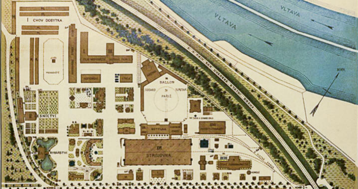
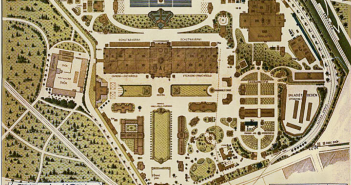

# Jubilejní zemská výstava v Praze 1891

Klikněte na budovy v historických pláncích

<button class="carousel-btn prev-btn" onclick="moveSlide(-1)">&#10094;</button>
<button class="carousel-btn next-btn" onclick="moveSlide(1)">&#10095;</button>
  

<h3>Plánek sever</h3>

<map name="plan1map">
<area shape="rect" coords="250,280,382,332" href="#/strojovna" alt="Strojovna" title="Strojovna">
</map>

<h3>Plánek jih</h3>

<map name="plan2map">
<area shape="rect" coords="210,100,447,150" href="#/hlavnipavilon" alt="Hlavní Pavilon" title="Hlavní Pavilon">
</map>

