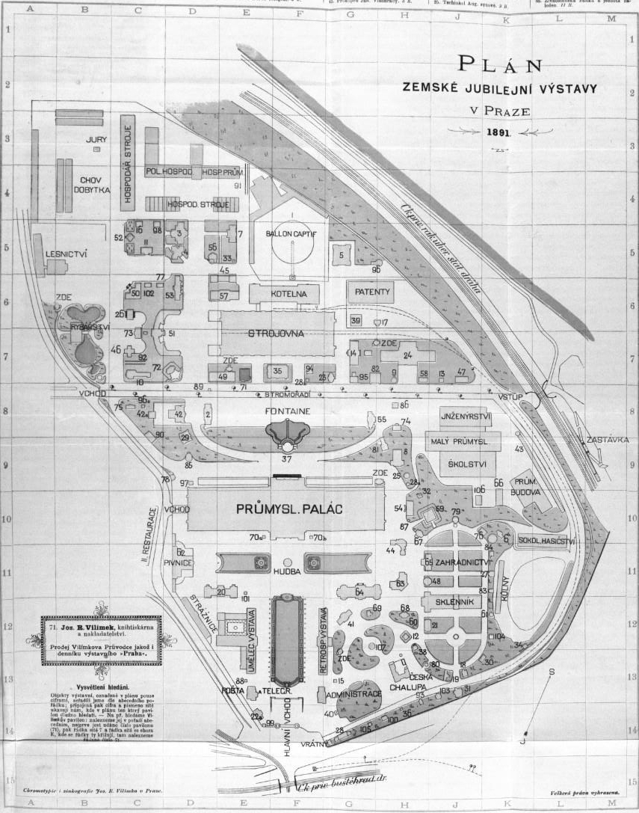

# Jubilejní výstava v Praze 1891

## O projektu
Tato stránka vznikla v rámci semestrální práce předmětu *Historie vědy a techniky 2* (BOM16HVT) na FEL ČVUT v Praze v letním semestru 25/26. Tématem tohoto týmového projektu je Jubilejní výstava v Praze 1891. 

Tento mimořádně náročný historický počin umožnil prezentovat technický pokrok českých zemí. Vznikl během ní památný areál Holešovického výstaviště, první elektrifikovaná tramvajová dráha nebo Petřínská rozhleda - jedna ze současných pražských dominant.

Pro prohlídku jednotlivých sekcí projektu využijte navigační lištu nalevo nebo vyhledávání.

## Plánek výstavy

*Plánek výstavního areálu. Zdroj: KRONBAUER, Rudolf Jaroslav. Naše jubilejní výstava: S přečetnými illustracemi. Praha: Vilímek, 1892, s. [372]. Dostupné také z: <a href="https://www.digitalniknihovna.cz/mlp/uuid/uuid:cd4b8720-f683-11dc-93b2-000d606f5dc6">https://www.digitalniknihovna.cz/mlp/uuid/uuid:cd4b8720-f683-11dc-93b2-000d606f5dc6</a>*

## Technické řešení projektu
Všechny stránky projektu jsou dokumenty ve formátu Markdown. Stránka je hostovaná přes [GitHub Pages](https://docs.github.com/en/pages) a využívá [Docsify](https://docsify.js.org/#/).