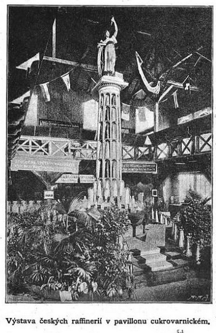
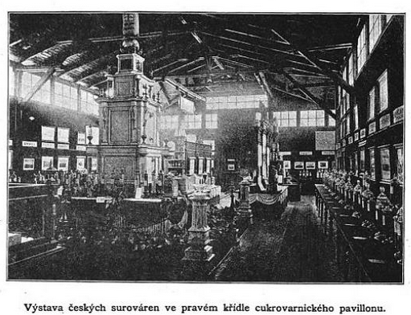
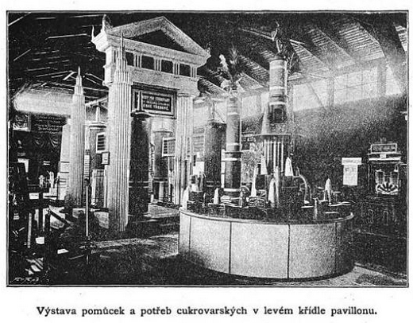
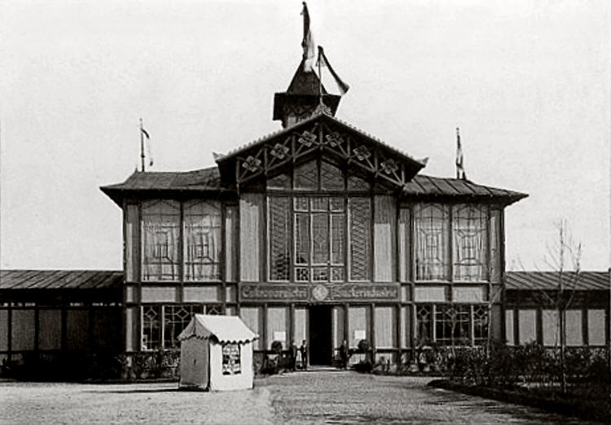

# Cukrovarnický pavilon

Cukrovarnický pavilon patřil mezi významné oborové expozice Jubilejní zemské výstavy v Praze 1891 a nacházel se ve východní části dolního areálu výstaviště, kde byly soustředěny průmyslové obory a soukromé pavilony. Cukrovarnictví bylo v té době jedním z nejrozvinutějších odvětví českého hospodářství, zaměstnávalo desítky tisíc lidí, zpracovávalo obrovské objemy surovin a mělo silný exportní charakter.

## Konstrukce pavilonu

Pavilon byl koncipován jako přehledný výstavní prostor členěný na několik částí – centrální prostor, pravé a levé křídlo a galerii. V pravém křídle byly prezentovány cukrovary a jejich produkce, včetně ukázek provozu a zatížení továren. Návštěvník si mohl udělat představu o rozsahu výroby i o technologickém postupu zpracování. Levé křídlo bylo věnováno cukrovarnickým strojům a pomůckám, často domácího původu. Střed pavilonu dominovala monumentální skupina rafinerií, která byla zároveň dekorativně upravena – doplněna sochou cukrovarnictví a vlajkami zemí, kam se český cukr vyvážel. Velmi důležitou částí pavilonu byla retrospektivní výstava, která ukazovala vývoj cukrovarnictví – od primitivních pokusů (např. výroba z javorové mízy nebo rané pokusy s řepou) až po moderní průmysl.

## Rozebrání a osud pavilonu

Cukrovarnický pavilon byl, stejně jako většina oborových staveb, navržen jako dočasný objekt. Po skončení výstavy byl rozebrán a nedochoval se.

Jeho význam však spočívá v tom, že poskytl mimořádně ucelený obraz českého cukrovarnictví – od historických počátků přes technologický rozvoj až po tehdejší špičkovou úroveň výroby a exportu. V pavilonu byly prezentovány pokroky v oboru, od přechodu od lisování k difuzi, ukázky využití parních strojů po konkrétní statistiky o produkci. Pavilon tak fungoval nejen jako prezentace průmyslu, ale i jako důkaz jeho světové konkurenceschopnosti.

## Obrázky

---

[→ Zdroje k této stránce](zdroje.md#zdroje-cukrovarnicky_pavilon)
