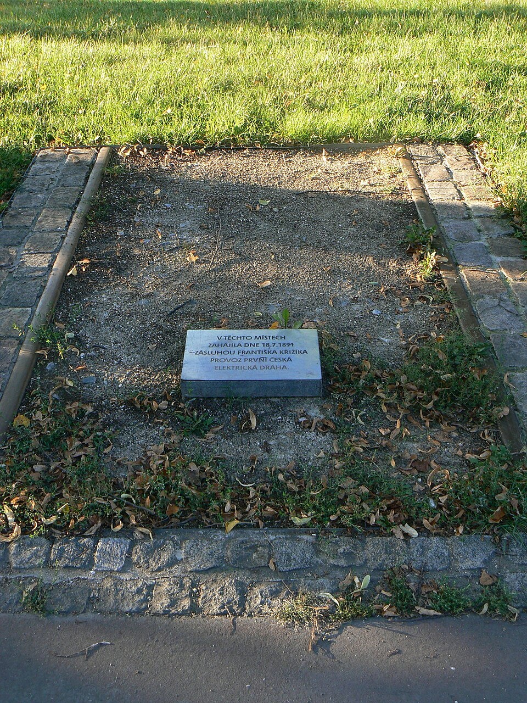
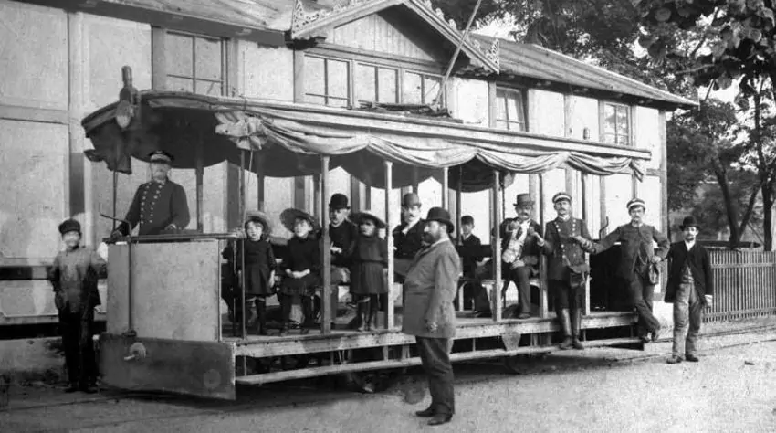

# Elektrická dráha z Letné na výstaviště

Jednalo se o první elektrifikovanou tramvajovou trať na území českých zemí. Byla v provozu od roku 1891 až do roku 1900. Trať byla lákadlem ke svezení do centra výstavy pro návštěvníky. Na trati jezdily kyvadlově dva vozy na jednokolejné dráze. Trať z počátku měřila 800 metrů, později - v roce 1893 - byla rozšířena na 1400 metrů s 3 zastávkami:

1.  Letenský zámeček - kde se přestupovalo na Lanavou dráhu na Letnou. Tato dráha dopravovala návštěvníky od bývalého řeťezového mostu císaře Františka Josefa I. (dnes zde stojí Štefáníkův most).

2.  Královská obora - zastávka byla v ulici Nad Královskou oborou.

3.  Místodržitelský letohrádek - tento úsek byl otevřen až v roce 1893.

Provoz zajišťovaly dva tramvajové vozy s jednoduchou otevřenou konstrukcí a byla pro ně postavena dočasná malá elektrárna na Letné. Tramvaje byly designovány na 250 voltů a jejich rychlost byla 10 km/h. Jedna z tramvají byla již použita na výstavě v Mnichově roku 1882. A druhý vůz byl postaven firmou Ringhoffer v roce 1891 s elektrovýzbrojí od Františka Křižíka.

Za tuto dráhu se nejvíce zasloužil její stavitel František Křižík. Nejspíše se inspiroval na Průmyslové výstavě roku 1879 v Berlíně. Jeho cílem bylo ukázat moderní tramvaje a propagovat elektrickou trakci jako budoucí dopravní obslužnost Prahy. Moderní elektrická dráha měla nahradit koňespřežné pražské Otletovy tramvaje (od 1875). Koncesi od císaře získal Křižík dne 11. května 1891. Stavba trati byla hotova již 4. července. Zkušební jízda vyjela již 6. července. Slavnostní uvedení elektrických tramvaji pro výstaviště do provozu proběhlo 18. července 1891.

Za zánikem této dráhy stálo jednak ukončení Jubilejní výstavy a jednak nerentabilita jejího provozu. Křižík nabídl Praze sice odkup této dráhy, ale obec o to neprojevila zájem. Přesto lze uvést, že svůj úkol první elektrická tramvaj splnila, protože ukázala výhody elektrické trakce pro tramvaje. Následně vznikly Elektrické podniky královského hlavního města Prahy v roce 1897, které řídily jednotlivé trasy pražských elektrifikovaných tratí pro tramvaje, a začala výstavba linek spojujících centrum s předměstími. I pro ně začala výstavba Holešovické elektrárny na střídavý proud, kterou vybavila továrna Elektrotechnická a.s. Emil Kolben Vysočany (EAS). Dnes původní dráhu na výstaviště připomíná zbytek kolejí u Letenského zámku.

## Obrázky

*Foto tramvají které sloužily na této elektrické dráze*

Kuriozita na závěr: toto nebyla jediná dráha, která se snažila o to, aby Praha využila elektrických tramvají. Sylvester Krnka představil svoji ideu, a to šlapací tramvaj. Její trať byla 500 metrů dlouhá. Šlo ale jen o kuriozitu, která po výstavě zmizela.

---

[→ Zdroje k této stránce](zdroje.md#zdroje-elektricka_draha_z_letne)
