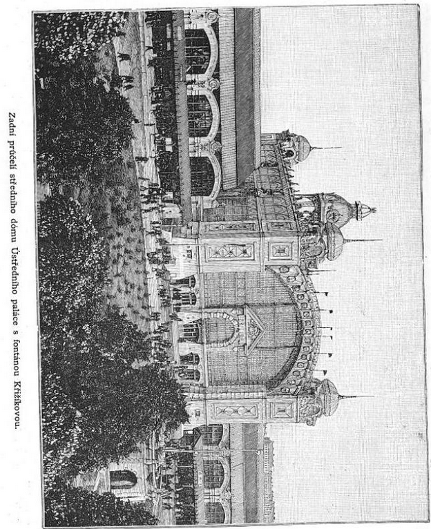
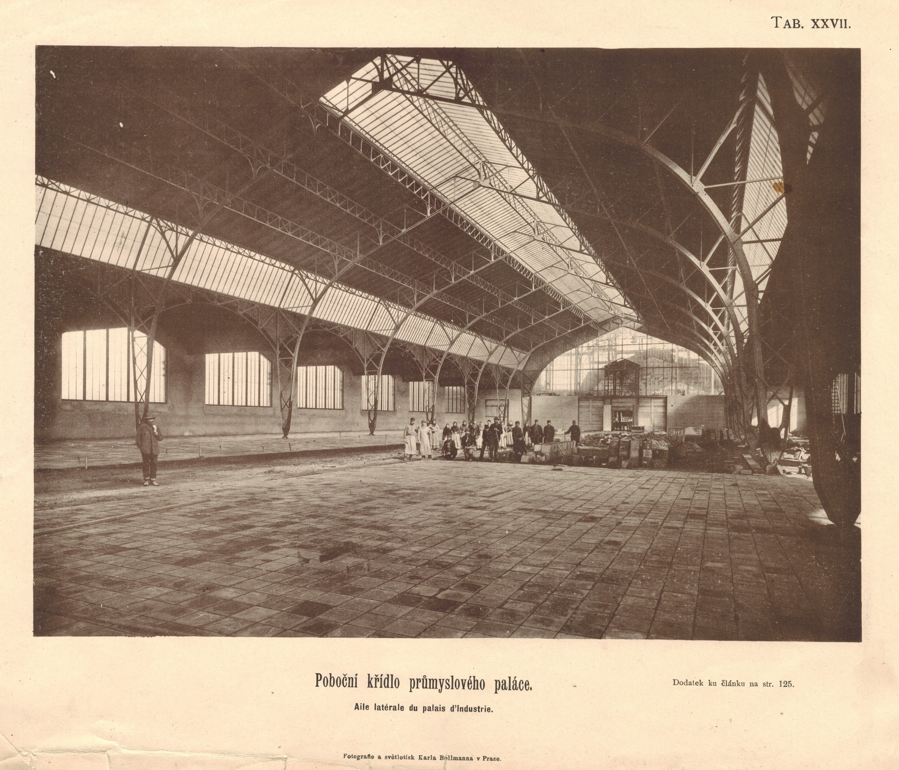
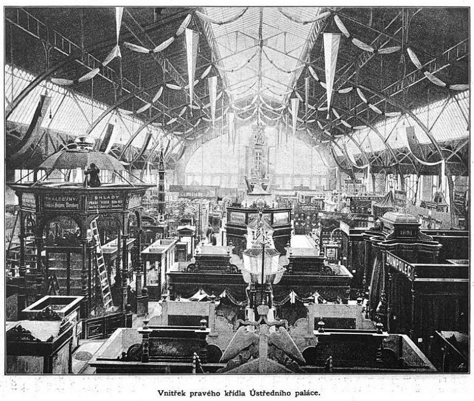
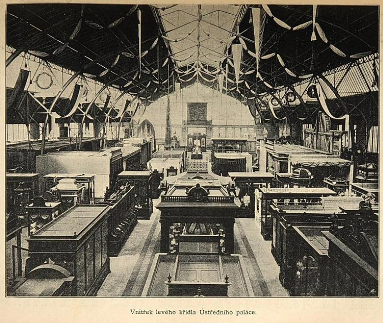
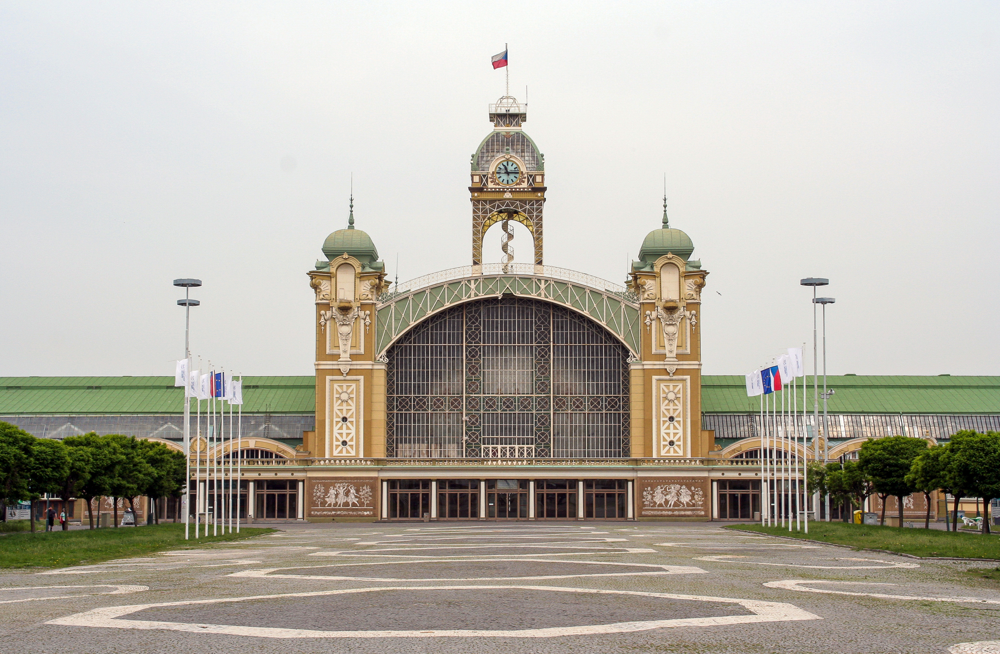
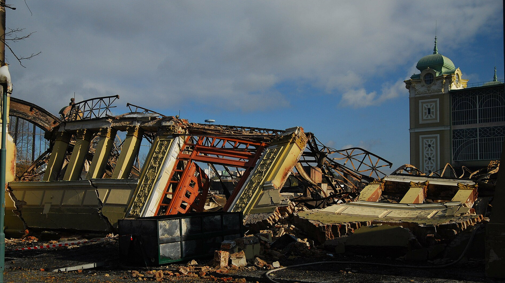
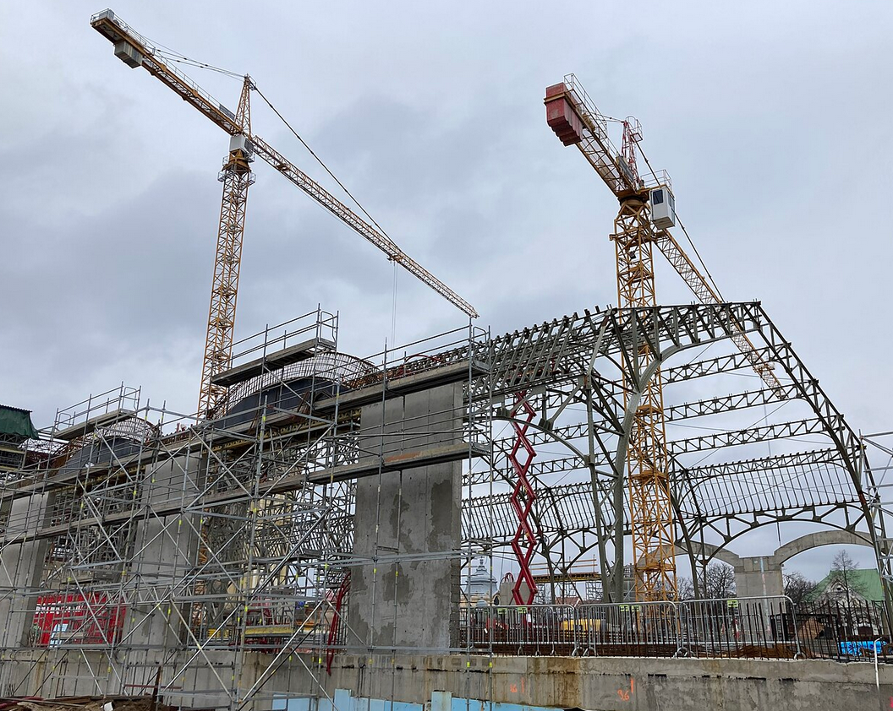

# Průmyslový palác

Průmyslový palác byl absolutní dominantou uprostřed výstaviště. Oproti ostatním pavilonům, často zaměřených na konkrétní obory, měl souhrnný a obecný charakter.

## Konstrukce paláce

Architekt Bedřich Münzberger chtěl původně vytvořit klasickou stavbu z cihel a omítky, ale pod vlivem mladých architektů, ovlivněných pařížskou *Světovou výstavou* z roku 1889 a tamní architekturou (např. Eiffelova věž) nakonec navrhl kombinaci tradiční a železné konstrukce, v českých zemích do té doby nevídanou.

Samotný projekt byl vypracován týmem pod vedením Bedřicha Münzbergera (1846–1928), do něhož náleželi zejména inženýr František Prášil (1845–1917) a architekt Friedrich Ohmann(1858–1927) a jeho žák Alois Dryák (1872–1932), kteří navrhli výzdobu zděných částí. Výstavbu z velké části provedla *První českomoravská továrna na stroje v Praze* (Kolben-Daněk), kde jako vrchní inženýr působil právě František Prášil (též byl spoluvlastníkem Mostárny Bratři Prášilové a spol. Praha-Libeň). Na výstavbě paláce se podílelo celkem 450 dělníků (a 150 montérů na železné konstrukci) v kritických letech 1890–1891, kdy výstaviště stihla povodeň i kruté mrazy.

*Zadní průčelí středové části Průmyslového paláce.*[\[8\]](zdroje.md#hlavnipavilon-ref-8)

Konstrukce byla tvořena masivní montovanou ocelovou sestavou se sklem, a poté standardním vyzděním. Za zmínku stojí rychlost výstavby – povodeň zatopila velkou část výstaviště a strhla část rozestavené konstrukce. Stavbu se i tak podařilo včas dokončit a otevřít v termínu pro zahájení výstavy, tj. 15. 3. 1891. Během konání výstavy navštívilo výstaviště přibližně 2,5 milionu lidí.

Středová část Průmyslového paláce disponovala velkou prosklenou kopulí a věží s hodinami (výška cca 50 m), kam se dalo vyjít točitým schodištěm a prohlédnout si celé výstaviště a Prahu samotnou z vyhlídkového ochozu. Na ní navazovalo pravé (východní) a levé (západní) křídlo.

*Vnitřek jednoho z křídel Průmyslového paláce bez expozic.*[\[9\]](zdroje.md#hlavnipavilon-ref-9)

Výzdoba zahrnovala sochy Leopolda II. a Františka Josefa I. či zemský znak a národní praporce z regionů českých zemí. Dále pak znaky měst z okolí Prahy, které se od roku 1922 staly součástí tzv. Velké Prahy (Smíchov, Karlín, Vinohrady), ale i znaky měst z ostatních částí tehdejších českých zemí (Kladno, Mladá Boleslav, Plzeň a další). Na věži paláce byla umístěna replika svatováclavské koruny, která byla osvětlena žárovkami Františka Křižíka. Křižík se postaral i o celkové osvětlení výstaviště. Mimo žárovek byly použity obloukovky, kterých jeho firma nainstalovala celkem 226. Na věž paláce nechal Křižík umístit i obří reflektor a také zkonstruoval světelnou fontánu. Do postranních průčelí paláce byla zasazena figurální okna představující *Průmysl* a *Vědu*, která byla provedena podle kartonů Mikoláše Alše (1852–1913) ze zlatožlutého katedrálního skla. Ke kombinování obrazců se spotřebovalo na milion barevných skleněných tabulek zalévaných do olova. Na výzdobě pravého i opravovaného levého křídla budou k vidění znaky různých cechů, což souviselo s vystavovanými materiály při Jubilejní výstavě. Interiér paláce byl upraven roku 1907 podle projektu architekta Josefa Fanty (1856–1954).

## Expozice paláce – vystavované obory

Vzhledem k velkému množství expozic se i v pláncích pro průchod výstavou většinou uvádělo rozdělení na obory, a nikoliv konkrétní seznamy vystavovatelů.

Středové části dominoval barokní královský pavilon, který sloužil pro slavnostní příležitosti – zahájení výstavy či návštěvy vedení tehdejší Rakousko-Uherské monarchie.

V pravém (východním) křídle se nacházely následující expozice:

- Výroba látek

- Kovové výrobky (železo, zlatnictví, stříbrné výrobky a další)

- Vědecké přístroje a hodinářství

- Papírnictví, knihařství a polygrafie

*Pravé křídlo Průmyslového paláce s expozicemi.*[\[8\]](zdroje.md#hlavnipavilon-ref-8)

V levém (západním) křídle byly k nalezení tyto obory:

- Oděvnictví

- Zařízení bytů – nábytkářství, truhlářství

- Hudební nástroje

- Drobné výrobky ze dřeva, kostí, korku, pryže a hračkářství

- Sklenářství, kamenictví, keramika

- Voňavkářství a lékárenství

*Levé křídlo Průmyslového paláce s expozicemi.*[\[8\]](zdroje.md#hlavnipavilon-ref-8)

## Další osud paláce

Objekt nebyl koncipován jako dočasný, a proto našel využití při dalších výstavách, ostatně jej najdeme na stejném místě dodnes.

Konala se zde například *Národopisná výstava českoslovanská* (1895), *Výstava architektury a inženýrství* (1898) či *Jubilejní výstava Obchodní a živnostenské komory* (1908).

Po druhé světové válce zde proběhl *Sjezd závodních rad a odborových organizací* (1948), přičemž v kontextu tehdejší politické situace byla svatováclavská koruna nahrazena rudou hvězdou. Zároveň bylo celé Výstaviště přejmenováno na *Park kultury a oddechu Julia Fučíka* a i Průmyslový palác byl přejmenován na *Sjezdový palác* (1948–1990). V letech 1952–1954 byl palác zrekonstruován podle projektu Pavla Smetany (1900–1986) a byl opatřen novými klenbami a vstupní přístavbou pro pořádání sjezdů Komunistické strany Československa (KSČ). V roce 1968 se zde konalo setkání tehdejších představitelů *Pražského jara*. Až do roku 1981 se zde konaly i sjezdy KSČ.

Po pádu komunistického režimu v listopadu 1989 se výstavišti vrátila tradiční jména a konala se zde navazující *Všeobecná československá výstava 1991*, která se měla stát manifestací nově vzniklého svobodného státu. Oproti úspěchu roku 1891 se ovšem nenaplnila očekávaná návštěvnost a postupně se objevovaly i různé kontroverze týkající se financování a majetkové struktury.

*Průmyslový palác v květnu 2008.* [\[10\]](zdroje.md#hlavnipavilon-ref-10)

V průběhu let proběhlo samozřejmě několik rekonstrukcí. Dne 16. 10. 2008 vyhořelo levé křídlo Průmyslového paláce kvůli neopatrné manipulaci s přímotopem. V současnosti (od roku 2015 přípravy, od 2022 stavební činnost podle dobové dokumentace) probíhá jeho rekonstrukce, přičemž se očekává dokončení na podzim 2026. Hlavní město Praha má za rekonstrukci zaplatit tři miliardy korun. Kromě obnovy samotného levého křídla je součástí rekonstrukce také oprava a rekonstrukce zbytku Průmyslového paláce (ocelové konstrukce, vitráže, odstranění socialisticko-realistické přestavby, obnova jižního portálu, hodinové věže, návrat Svatováclavské koruny na věž atd.) a vybudování podchodu pod střední částí. Levé křídlo bude obnoveno s odhalenou svařovanou konstrukcí (s imitacemi nýtů), zatímco pravé křídlo zůstane v podobě po rekonstrukci z 50. let 20. století.

Výstaviště by se mělo v budoucnu rozdělit do pěti zón. Jednotlivé zóny budou věnované kultuře (Průmyslový palác, Lapidárium, Pavilón AVU, Vodní svět, restaurace), zábavě, sportu (Velká sportovní hala, Malá sportovní hala, plavecký bazén a divadlo Pyramida), relaxaci a prostoru pro konání open-air akcí (Křižíkova fontána a pavilony, Maroldovo panoráma a divadlo Spirála).

*Trosky levého křídla Průmyslového paláce po požáru v roce 2008.*[\[6\]](zdroje.md#hlavnipavilon-ref-6)

*Stavba levého křídla Průmyslového paláce – obnova – foto z února 2024.*[\[7\]](zdroje.md#hlavnipavilon-ref-7)

---

[→ Zdroje k této stránce](zdroje.md#zdroje-hlavnipavilon)
