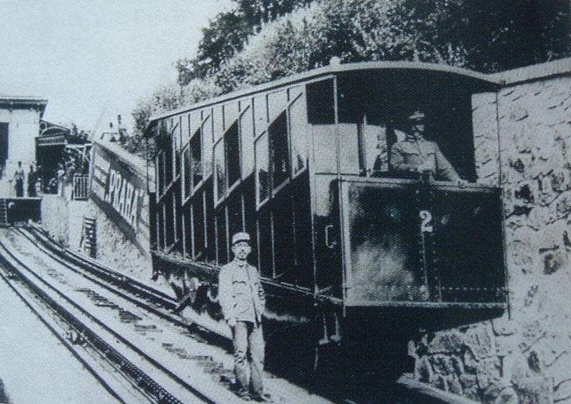
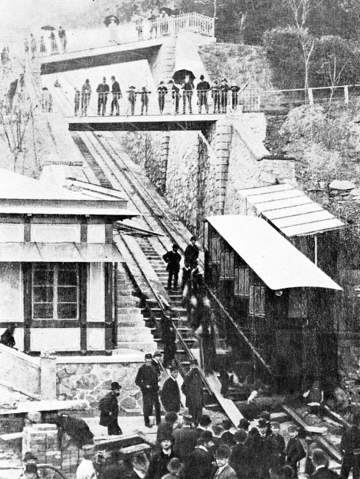
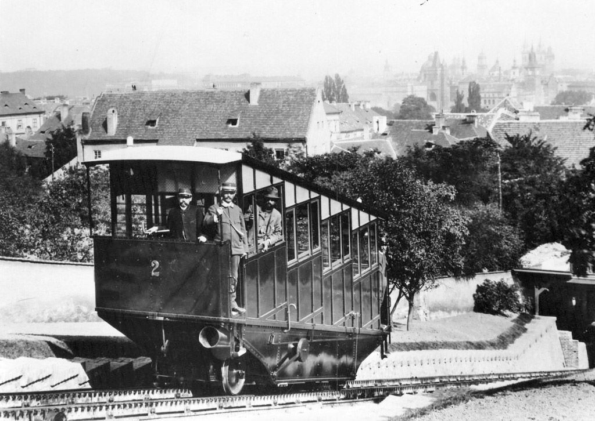
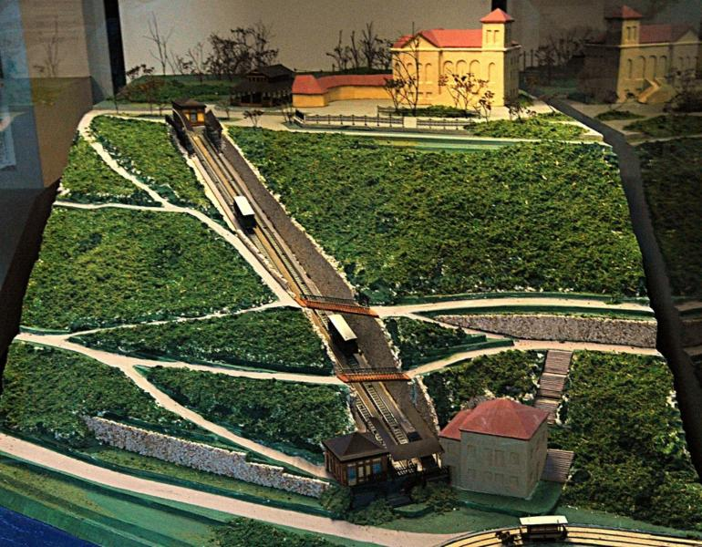
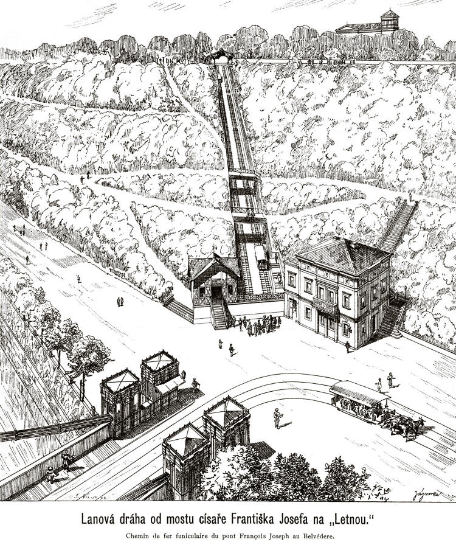

# Lanové dráhy – Petřín a Letná

## Konstrukce lanových drah

Obě pražské lanové dráhy vznikly v přímé souvislosti se Jubilejní výstavou v roce 1891 a představovaly unikátní technická řešení tehdejší doby. Lanová dráha na Letnou byla zprovozněna jako první, a to 31. května 1891. Její trať vedla od tehdejšího mostu císaře Františka Josefa I. (dnešní Štefánikův most) k Letenskému zámečku. Jednalo se o dráhu s rozchodem kolejí 1000 milimetrů, na kterou dodala dva čtyřicetimístné vozy firma Ringhoffer.[\[1\]](zdroje.md#lanove_drahy_petrin_a_letna-fn-1)

Výstavbu lanovky na Petřín inicioval *Klub českých turistů*, potažmo jím založené *Družstvo rozhledny na Petříně*. Projekt vypracovali inženýři Josef Reiter a Alois Štěpán. Petřínská lanovka překonávala původně po tříkolejnicové trati s Abtovou ozubnicí délku 390 metrů a výškový rozdíl přes 100 metrů. Obě lanovky spojoval původní, finančně náročný systém pohonu na principu vodní převahy. Do nádrže horního vozu se napustilo 4 až 5 metrů krychlových vody, čímž vůz ztěžkl a při své cestě dolů vytáhl lany nahoru vůz spodní, z něhož se naopak voda dole vypustila.[\[2\]](zdroje.md#lanove_drahy_petrin_a_letna-fn-2)[\[3\]](zdroje.md#lanove_drahy_petrin_a_letna-fn-3)

## Význam lanových drah

Lanové dráhy fungovaly během výstavy jako samostatné technické atrakce demonstrující dobový pokrok. Letenská lanovka měla navíc klíčovou logistickou roli – tvořila bezprostřední přestupní uzel na Křižíkovu elektrickou dráhu, která od 18. července 1891 vozila návštěvníky z Letné přímo do Královské obory na výstaviště. Jízda letenskou lanovkou nahoru stála tehdy 3 krejcary a cesta dolů krejcary dva.[\[4\]](zdroje.md#lanove_drahy_petrin_a_letna-fn-4)[\[5\]](zdroje.md#lanove_drahy_petrin_a_letna-fn-5)

Petřínská lanovka naopak sloužila jako dopravní prostředek k pražské „malé Eiffelovce" a pavilonu se zrcadlovým bludištěm. První cestující svezla petřínská dráha 25. července 1891, avšak k jejímu slavnostnímu otevření došlo souběžně s rozhlednou 20. srpna 1891. Vodní pohon se však u lanovek brzy ukázal jako neekonomický a problematický, protože například v zimě voda částečně namrzala.[\[6\]](zdroje.md#lanove_drahy_petrin_a_letna-fn-6)[\[7\]](zdroje.md#lanove_drahy_petrin_a_letna-fn-7)

## Osud lanových drah

Dějiny obou staveb se postupem času výrazně rozešly. Lanovka na Letnou byla kvůli drahému vodnímu provozu v letech 1902–1903 elektrifikována Františkem Křižíkem, což umožnilo její celoroční provoz. Jezdila do listopadu 1916 a v letech 1926–1935 ji nahradil unikátní pohyblivý chodník (eskalátor) s dřevěnými stupni. Zbytky tohoto zařízení zcela zanikly na přelomu 40. a 50. let 20. století při stavbě Letenského tunelu, dodnes se zachovala jen torza opěrných zdí ve svahu.[\[8\]](zdroje.md#lanove_drahy_petrin_a_letna-fn-8)

Lanovka na Petřín přerušila provoz kvůli první světové válce v roce 1914 (respektive 1916) a dlouho chátrala. Zásadní proměnou prošla v letech 1931–1932, kdy byla podle návrhu architekta Františka Šrámka modernizována, prodloužena na 511 metrů a elektrifikována firmou ČKD. Spolehlivě pak jezdila až do června 1965, kdy podmáčený petřínský svah postihly masivní sesuvy půdy, které trať zničily. K obnově došlo až v roce 1985 s novými vozy z vagonky Tatra. Další přírodní pohroma zasáhla dráhu v září 2024, kdy extrémní srážky opět vážně poškodily svah i samotnou trať. V současnosti je dráha uzavřena, prochází komplexní rekonstrukcí včetně návrhu a výroby nových vozů a návrat cestujících je naplánován na přelom léta a podzimu 2026.[\[9\]](zdroje.md#lanove_drahy_petrin_a_letna-fn-9)[\[10\]](zdroje.md#lanove_drahy_petrin_a_letna-fn-10)

## Obrázky

---

[→ Zdroje k této stránce](zdroje.md#zdroje-lanove_drahy_petrin_a_letna)
