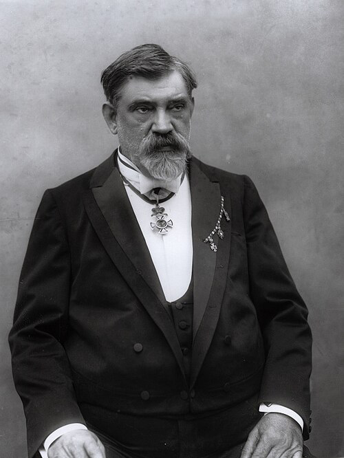
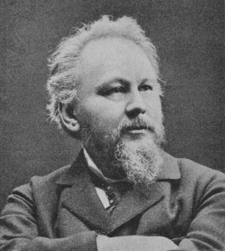
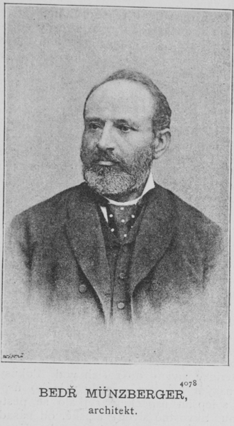
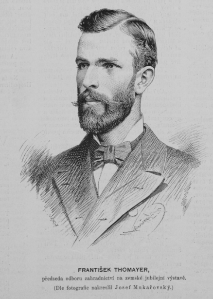

# Osobnosti a organizace Jubilejní výstavy

## Kdo stál za organizací výstavy

Jubilejní zemská výstava z roku 1891 nevznikla náhodně, ale byla výsledkem spolupráce řady významných osobností české společnosti. Na její přípravě se podíleli architekti, inženýři, podnikatelé i odborníci z různých oborů, kteří společně vytvořili moderní a rozsáhlý výstavní projekt.

Organizace výstavy byla řízena výstavním výborem v čele s Františkem Křižíkem (1847–1941), který v té době předsedal *Spolku inženýrů a architektů v Království českém (SIA)*. Výbor určoval celkovou koncepci a koordinoval jednotlivé části projektu. Důležitou roli zde hrála schopnost propojit technické, umělecké i organizační dovednosti.

## Architekti a tvůrci výstaviště

Klíčovou roli při realizaci výstavy měli architekti a projektanti, kteří navrhovali podobu celého areálu i jednotlivých pavilonů.

Mezi nejvýznamnější patřil **Bedřich Münzberger (1846**–**1928)**, hlavní projektant výstaviště a spoluautor Průmyslového paláce. Jeho práce určovala základní podobu areálu i jeho technické řešení.

Na architektonickém návrhu se podílel také **Antonín Wiehl (1846**–**1910)**, který patřil k významným představitelům české architektury 19. století. Přispěl k vytvoření reprezentativního vzhledu výstavních budov.

O celkové uspořádání zeleně a okolního prostoru se postaral **František Josef Thomayer (1856**–**1938)**, který navrhl sadové úpravy a přispěl k tomu, že výstaviště působilo nejen funkčně, ale i esteticky.

## Technické osobnosti

Vedle architektů hráli důležitou roli také technici a vynálezci, kteří se podíleli na moderním vybavení areálu.

Nejvýznamnější osobností v této oblasti byl **František Křižík.** Zajišťoval elektrifikaci výstaviště a jeho práce umožnila využití moderních technologií, které patřily k největším lákadlům celé akce.

Křižík propagoval elektrické osvětlení zasloužil zejména o vznik výstavy, zavedení jejího elektrického osvětlení, elektrické dopravy, osvětlené fontány a realizaci technických prvků, které ukazovaly pokrok tehdejší vědy a průmyslu.

## Spolupráce odborníků

Na organizaci výstavy se nepodíleli pouze jednotlivci, ale rozsáhlé týmy odborníků. Architekti, inženýři, řemeslníci i podnikatelé spolupracovali na realizaci jednotlivých částí projektu.

Důležitá byla také koordinace mezi jednotlivými profesemi. Úspěch výstavy byl výsledkem propojení technických znalostí, organizačních schopností a tvůrčí práce.

## Význam osobností pro výstavu

Zapojené osobnosti představovaly špičku tehdejší české společnosti. Jejich práce umožnila vznik moderního výstavního areálu, který odpovídal evropským standardům své doby.

Díky jejich spolupráci se podařilo vytvořit projekt, který byl nejen technicky pokrokový, ale i architektonicky a kulturně významný.

## Medailonky osobností:

### František Křižík

František Křižík (1847–1941) byl významný český vynálezce a elektrotechnik. Pro Jubilejní výstavu v roce 1891 zajistil elektrifikaci areálu a vytvořil slavnou světelnou fontánu, která patřila k největším atrakcím. Podílel se také na vybudování první elektrické tramvaje v Praze, která vozila návštěvníky na výstaviště. Je považován za jednu z klíčových osobností rozvoje elektrotechniky v českých zemích.

*Portrét Františka Křižíka, českého elektrotechnika, pořízený pravděpodobně kolem roku 1902 v době jeho členství v Panské sněmovně.*[\[9\]](zdroje.md#osobnosti-ref-9)

### Antonín Wiehl

Antonín Wiehl (1846–1910) byl český architekt a představitel historismu. Patřil mezi významné organizátory a tvůrce architektonické podoby výstavy, kde se podílel na návrhu pavilonů inspirovaných českou renesancí. Byl také aktivní ve veřejném životě, například jako předseda Spolku inženýrů a architektů.

*Portrét Antonína Wiehla, českého architekta a významného představitele novorenesance, který se podílel na architektonickém řešení Jubilejní výstavy.*[\[10\]](zdroje.md#osobnosti-ref-10)

### Bedřich Münzberger

Bedřich Münzberger (1846–1928) byl český architekt a hlavní projektant výstaviště. Navrhl také Průmyslový palác, hlavní budovu celé výstavy, která se stala symbolem moderní architektury své doby. Jeho práce významně ovlivnila celkovou podobu areálu a technické řešení výstavy.

*Portrét Bedřicha Münzbergera, českého architekta a hlavního projektanta výstaviště Jubilejní výstavy v Praze (1891).*[\[11\]](zdroje.md#osobnosti-ref-11)

### František Josef Thomayer

František Josef Thomayer (1856–1938) byl zahradní architekt a odborník na krajinářství. Na Jubilejní výstavě se podílel na návrhu sadových úprav a zeleně v areálu. Díky jeho práci působilo výstaviště nejen funkčně, ale i esteticky a přívětivě pro návštěvníky.

*Portrét Františka Thomayera, českého zahradního architekta a autora sadových úprav výstaviště Jubilejní výstavy v Praze (1891).*[\[12\]](zdroje.md#osobnosti-ref-12)

---

[→ Zdroje k této stránce](zdroje.md#zdroje-osobnosti)
