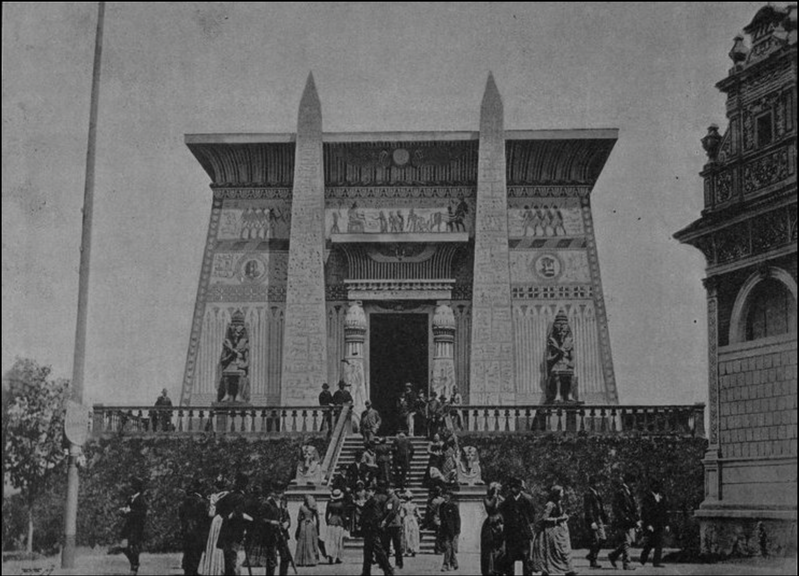

# Papírenský pavilon

Papírenský pavilon byl jedním z architektonicky nejzajímavějších objektů Jubilejní zemské výstavy v Praze 1891. Reprezentoval tradiční, ale zároveň modernizující se papírenský průmysl, který měl v českých zemích silné postavení.

## Konstrukce pavilonu

Autorem návrhu byl architekt Rudolf Koukola, který zvolil poměrně netradiční styl inspirovaný staroegyptskou architekturou. To bylo na tehdejší dobu neobvyklé a pavilon tak výrazně vyčníval mezi ostatními stavbami. Odkaz k Egyptu však nebyl náhodný, právě tam se totiž používal předchůdce papíru papyrus. V průčelí pavilonu se tak například nacházely sochy faraonů, před vchodem se dokonce tyčily dvě hieroglyfy pokryté obelisky.\
Konstrukčně šlo o dřevěnou stavbu s omítaným povrchem, která byla umístěna na uměle navršeném podstavci. Ten dodával objektu monumentálnější charakter, přestože šlo o dočasnou výstavní stavbu. Celkové řešení kombinovalo dekorativní přístup s praktičností výstavního prostoru.[\[1\]](zdroje.md#papirensky_pavilon-fn-1)

## Hlavní expozice a vystavovatelé

Uvnitř pavilonu byla prezentována výroba papíru od surovin až po finální produkty. Expozice zahrnovala jak technologické postupy, tak i samotné výrobky – různé druhy papíru, tiskoviny nebo speciální papírenské produkty.\
Důraz byl kladen na kvalitu a konkurenceschopnost české produkce. Pavilon tak fungoval nejen jako prezentace jednotlivých podniků, ale i jako ukázka vyspělosti celého odvětví. Podobně jako u jiných pavilonů výstavy byla snaha návštěvníkům přiblížit výrobu co nejvíce názorně, často pomocí ukázek nebo modelů zařízení.[\[2\]](zdroje.md#papirensky_pavilon-fn-2)

## Rozebrání a osud pavilonu

Na rozdíl od většiny ostatních pavilonů měl papírenský pavilon zajímavý další osud. Po skončení výstavy byl rozebrán a přenesen na Petřín, kde byl znovu postaven. V upravené podobě dnes slouží jako Zrcadlové bludiště na Petříně, které patří mezi známé turistické atrakce v Praze.\
Tento případ dobře ukazuje, že i dočasné výstavní stavby mohly získat trvalé využití, pokud měly architektonickou nebo kulturní hodnotu. Papírenský pavilon tak přežil dodnes, i když v mírně pozměněné podobě.[\[3\]](zdroje.md#papirensky_pavilon-fn-3)

## Obrázky

*Pohled na Papírenský pavilon na Jubilejní zemské výstavě v Praze 1891.*[\[4\]](zdroje.md#papirensky_pavilon-fn-4)

---

[→ Zdroje k této stránce](zdroje.md#zdroje-papirensky_pavilon)
