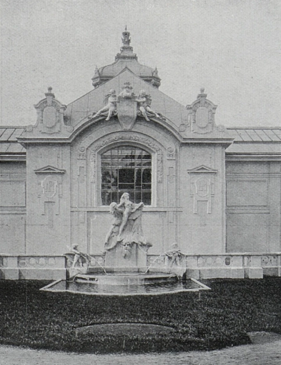
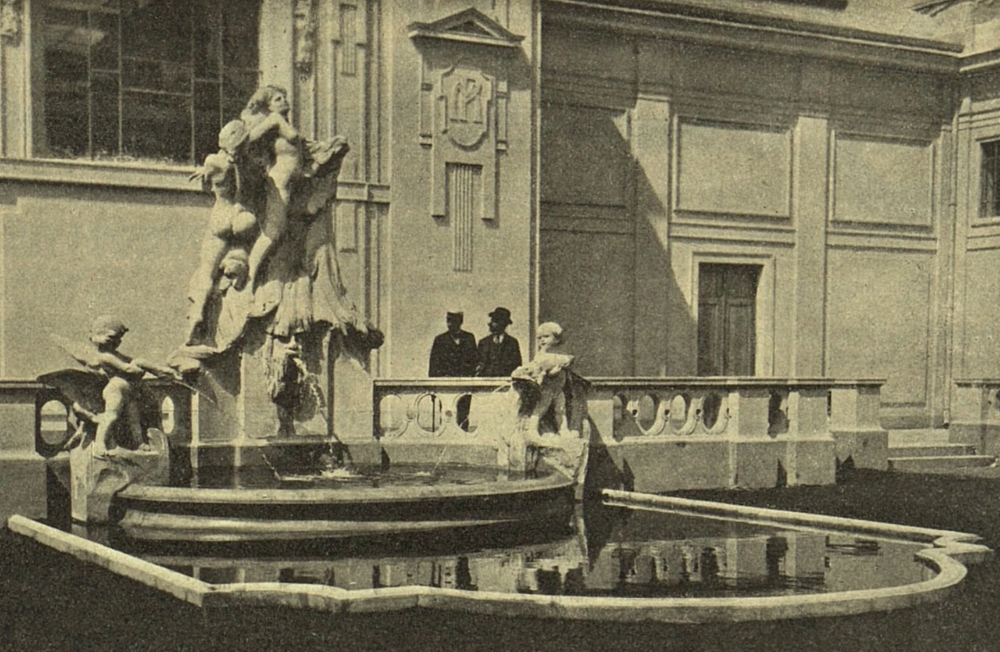
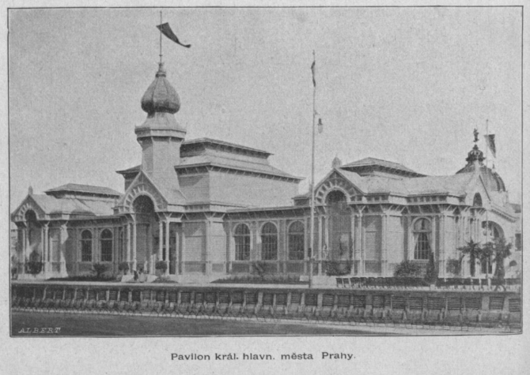
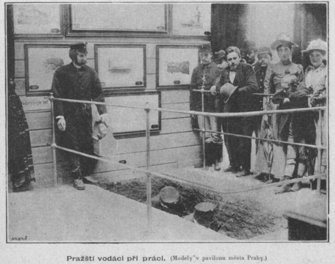
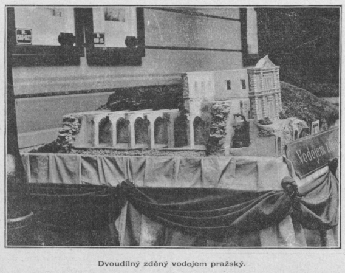
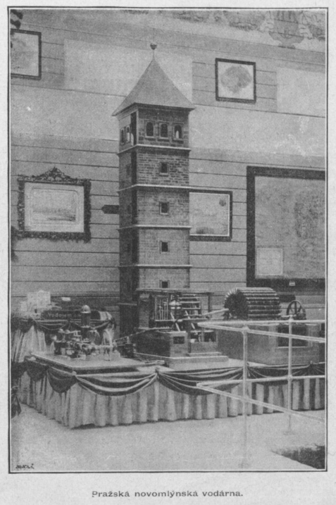

# Pavilon Královského hlavního města Prahy

## Konstrukce

V době Jubilejní výstavy roku 1891 byla podél hlavní cesty, vedoucí k Průmyslovému paláci, postavena novorenesanční budova pavilonu *Retrospektivní výstavy*, podle návrhu Antonína Wiehla. Po jejím skončení byla budova nadále využívána k výstavním účelům. V roce 1907 byla původní budova zbourána, a na jejím místě vznikla secesní stavba, nová a větší než původní pavilon, nyní - tzv. Pavilon Královského hlavního města Prahy,

Tento pavilon (označení "Královské hlavní město Praha" se používalo od sloučení pražských měst v roce 1784 za Josefa II. až do vzniku tzv. Velké Prahy v roce 1922 jako hlavního města Československé republiky) byl navržen Ing. Antonínem Hrubým po vzoru pařížského pavilonu na Světové výstavě roku 1889 (*Exposition universelle*)v Paříži ve Francii. Tamější výstava byla spojena se 100. výročím Francouzské revoluce a jejím hlavním symbolem se stala Eiffelova věž. Pražský pavilon byl menších a skromnějších rozměrů, ale jeho význam pro české země byl značný, neboť reprezentoval úspěchy města Prahy na poli správy obce a sociálních věcí (spořitelna, pojišťovna), urbanizace a industrializace. Za pavilonem vznikla parková úprava s fontánou. Fontánu tvořil mělký bazén vycházející ze zídky, jež byla součástí budovy pavilonu. Na zídce bylo umístěno novobarokní sousoší, na jehož soklu se nacházel chrlič ve tvaru maskaronu. Po stranách sousoší se nacházely dvě sošky andělíčků svírajících blíže neidentifikovaná zvířata, z jejichž tlam tryskala voda, která dopadala do menšího elipsovitého vyvýšeného bazénku, z něhož pak přepadala do zmíněného většího mělkého bazénu. Autorem fontány byl pravděpodobně sochař Jílek.

Pavilon vystihuje úryvek z *Výstavního časopisu Praha*:

*„Praha pravda je menší než Paříž a o mnohé zařízení světové ovšem i chudší. Avšak pražský pavilon zřízený zcela dle vzoru pařížského výstavy světové dojímá tak příjemně, že příjemný dojem ten nezmizí nikomu ani když si vzpomene na pavilon města Paříže z výstavy světové. I to jest příjemné přirovnání, že obě města Paříž a Praha jsou srdcem svých národů, srdcem svých zemí: svobodné Francie a našich zemích českých."*[\[1\]](zdroje.md#pavilon_prazsky-fn-1)

## Expozice

Pavilon sloužil jako reprezentativní přehlídka fungování pražské obecní správy a ukazoval návštěvníkům, jak moderní velkoměsto zařizuje své inženýrské sítě, vzdělávání i sociální péči. Expozice svým složením měla být vzorem a motivací pro menší města a vesnice, kterým směrem se v tehdejší době rozvoje techniky mají ubírat.

Z hlediska vodovodních systémů byly vystaveny různé výkresy, mapy, protokoly o správě vodních sítí či dokumentace související s nemocemi, které mohly vzniknout v případě znečištění pražských studen. Dále zde byly představeny ukázkyslužeb, které město poskytovalo sociálně slabším, například sirotkům a chudým starším lidem. Obzvláště u dětí se zdůrazňovala nutnost alespoň základního zázemí pro jejich rozvoj. Na tuto problematiku na výstavě navázala tématika školství, včetně výuky řemesel.

*Reprodukce z časopisu Český svět, 1908, roč. 4.*[\[2\]](zdroje.md#pavilon_prazsky-fn-2)

*Reprodukce z časopisu Světozor, dne 29. 5. 1908.*[\[3\]](zdroje.md#pavilon_prazsky-fn-3)

## Další obrázky

---

[→ Zdroje k této stránce](zdroje.md#zdroje-pavilon_prazsky)
