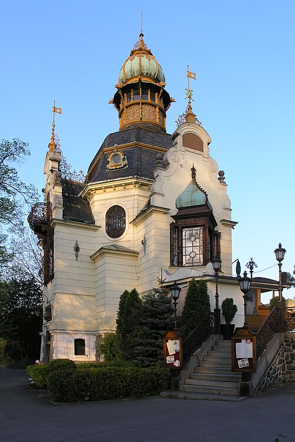
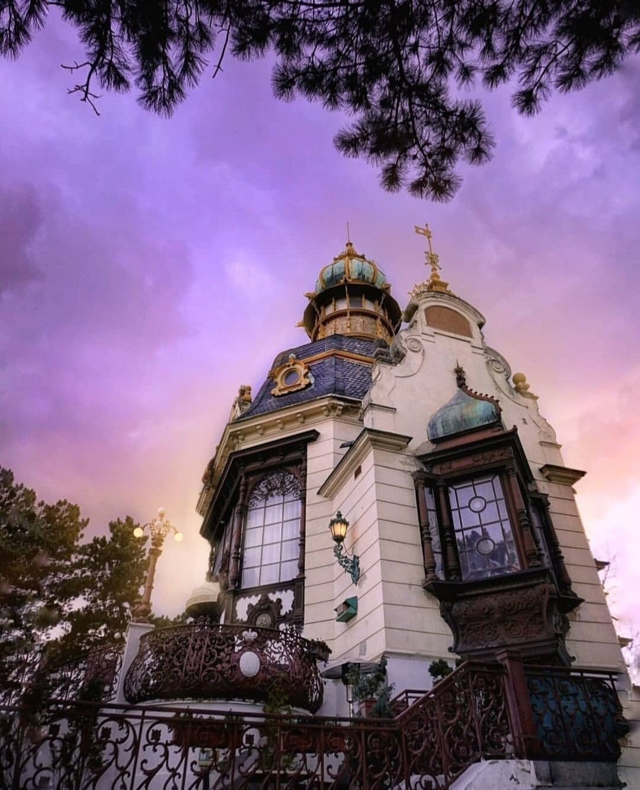
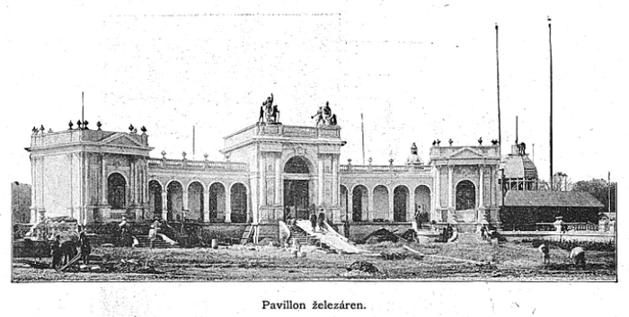
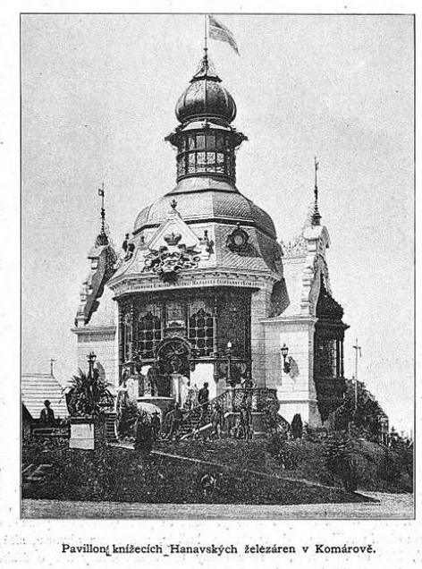
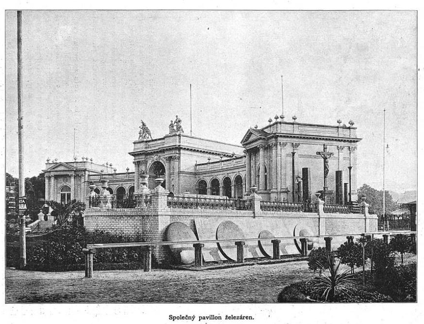
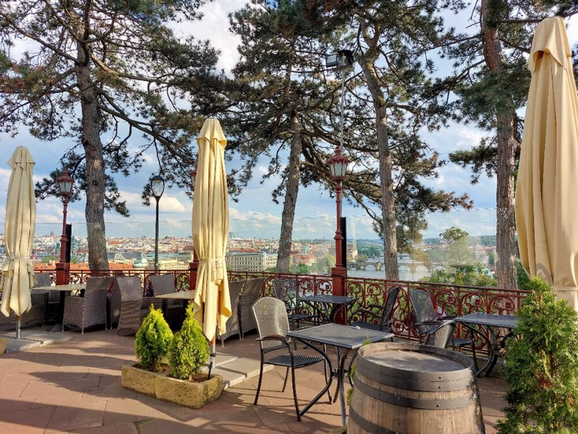

# Hutě – železárny

Hutnictví a železárny byly soustředěny zejména do dvou pavilonů naproti západní stěně Strojovny. Některé expozice byly rozptýleny do dalších míst.

## Souborný pavilon hutnictví

Souborný pavilon, jak již název napovídá, sloužil několika tehdejším významným podnikům.

## Konstrukce

Základní tvar Souborného pavilonu byla podkova s vnitřním parkem. Návrh provedl architekt Eduard Frauenfeld, mladší (1853–1910) z Vídně ve slohu francouzské renesance. Samotnou stavbu pak organizoval a provedl pražský stavitel Alfred Wertmüller ([1852](https://cs.wikipedia.org/wiki/1852)–[1916](https://cs.wikipedia.org/wiki/1916)).

Zajímavá symbolika spočívala v samotném materiálu. Ke stavbě byl užit cement z vysokopecní strusky, která pocházela z Královédvorské továrny na cement. Ke střední části budovy vedlo dvanáctistupňové schodiště. Nacházelo se zde mnoho dekoračních prvků, např.:

- **Lité sousoší Hutnictví a Hornictví** vzniklo v dílně sochaře a restaurátora Karla Vlačihy (1850-1932) v Praze podle návrhu dalšího českého sochaře-figuralisty Františka Hergesela (1857–1929). Jejich díla či restaurátorské práce lze nalézt například na Národním muzeu či na Karlově mostě.

- **Tepaný rakouský orel** byl technologickou demostrací vláčnosti materiálu – ocelového plechu, ze kterého byl vyroben.

- **Model** Karlo-Emilovy huti (Králův Dvůr u Berouna) se nacházel uprostřed vestibulu..

## Expozice

Expozice se skládala z prvků a výrobků, které představovala celou cestu – od dolu až k výrobku – od rud až po kolejnice či plechy. Výběr ukazuje produkci významných podniků, které prezentovaly výrobky svoje a přidružených hutí, např.:

- **Pražská železářská společnost:** Vystavovala páskové železo různých typů, plány svých závodů a technologických procesů, produkty válcoven, nápravy pro vozy, výrobu drátů. Dále pak stroje pro testování materiálů – trhačku – se sílou tahu odpovídající 70 tunám.

- **Teplické válcovny:** Produkty válcoven, železniční prvky – kolejnice a pražce, pluhy či části parních kotlů. Z neprůmyslových výrobků lze zmínit různé typy plechů se zdobnou úpravou či výrobky z nich (poháry, svícny, vázy). Velkou technologickou zajímavostí byly výrobky z jejich hydraulického lisu, který měl na tehdejší dobu obdivuhodný tlak 80 atmosfér. Z testovacích strojů bylo vystaveno parní kladivo.

- **Teplická továrna na lopaty:** Expozice běžného nářadí – lopaty, rýče, kladiva, sekery atd. Ačkoliv se dnes takováto expozice zdá obyčejná, původně se toto zboží muselo dovážet z oblastí Štýrska či Německa.

- **Ocelárna Poldiny huti na Kladně:** Firma byla založena těsně před Jubilejní výstavou v Kladně roku 1889 Karlem Wittgensteinem (1847–1913) a byla tehdy známá výrobou vysoce kvalitní ušlechtilé oceli. Proto vystavovala různé typy oceli (kelímková a ušlechtilá ocel, později nerezová ocel), včetně vzorků ze zkušebních strojů, kde byla patrná kvalitní a homogenní struktura. I tento podnik vystavil stroj – zkušební trhačku se sílou tahu odpovídající 120 tunám. Později byla součástí Pražské železářské společnosti.

## Hanavský pavilon

Tento pavilon sloužil pouze jedné společnosti – železárnám knížete Viléma Hanavského (Wilhelm von Hanau, 1836–1901) v Komárově u Hořovic. Oproti Soubornému pavilonu se zaměřoval na uměleckou litinu,, čemuž odpovídalo celkové provedení. Stavbou svého pavilonu pro Jubilejní výstavu významně přispěl k české průmyslové kultuře 19. století.

*Hanavský pavilon v Letenských sadech v Praze, jeho dnešní podoba.*[\[1\]](zdroje.md#pavilon_zelezaren-fn-1)

*Detail věžičky a kovaného balkonu Hanavského pavilonu za soumraku.*[\[2\]](zdroje.md#pavilon_zelezaren-fn-2)

## Konstrukce

Stavba byla označována již v době svého vzniku "perla mezi pavilony". Provedení bylo ve slohu holandského (novo)baroka a byl postaven z tehdy moderních materiálů – železa, litiny a skla – doplněných klasickým zdivem. Pavilon měl litinovou konstrukci, která nesla množství ornamentů, které byly ještě nedávno považovány za vyrobitelné pouze klasickým uměleckým kovářstvím.

## Expozice

Vzhledem k uměleckému zaměření pavilonu splývá samotný koncept stavby s výzdobou a expozicí. Podklady uvádí následné prvky v interiéru:

- Plastická reprodukce Večeře Páně (podle Leonarda da Vinciho).

- Orel s křídly rozepjatými k letu na masivním sloupu (podle vídeňského sochaře Jindřicha Natera).

- Poniklovaný lustr s galvanickými ozdobami – demonstrace tehdejších elektrochemických procesů.

- Z běžnějších výrobků lze jmenovat litinové roury, nádobí, kamna a další.

## Osud pavilonu

Pavilon měl zajímavý osud i po ukončení výstavy, kdy kníže stavbu daroval městu Praze. Následně byl pavilon rozebrán a přenesen do Letenských sadů, kde stojí dodnes. Ve druhé polovině 20. století prošel několika rekonstrukcemi, při kterých bohužel zanikly některé charakteristické prvky. Dnes slouží jako restaurace s krásnými výhledy na západní vltavský břeh Prahy a pořádají se zde i mnohé kulturní akce.

## Expozice na dalších místech

Stručný přehled expozic podniků hutí-železáren na dalších místech:

- **Železárny královského města Rokycany:** V západním křídle inženýrské budovy se nacházela expozice tohoto podniku, za zmínku stojí litinová pyramida.

- **Železárny Rotava**–**Nejdek** (roku 1909 vznikla spojením s nejdeckými železárnami, provozovanými vídeňskou firmou C. T. Petzold, akciová společnost *Železárny Rotava* – *Nýdek*)**:** Expozice u kotelny, s vystavením různých druhů plechů, vymodelovaný hraběcí znak a stříšky z vlnitého plechu, galantérní zboží, železný nábytek či vojenské vybavení – např. konzervy, polní láhve aj.

- **Zbirožské železárny Max Hopfengaertner (1842–1918):** Expozice v západním konci Strojovnyobsahovala vroubené zábradlí a množství obráběcích strojů (soustruhy, vrtací stroje, hoblovky, frézy). Z hlediska budování infrastruktury lze zmínit též sloupy pro obloukové lampy či odpadní roury. Firma též vystavovala svou produkci žehliček, kterých vyráběla desetitisíce kusů ročně.

## Další obrázky

---

[→ Zdroje k této stránce](zdroje.md#zdroje-pavilon_zelezaren)
