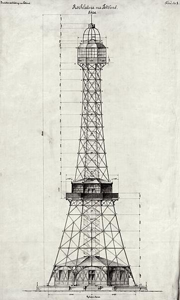
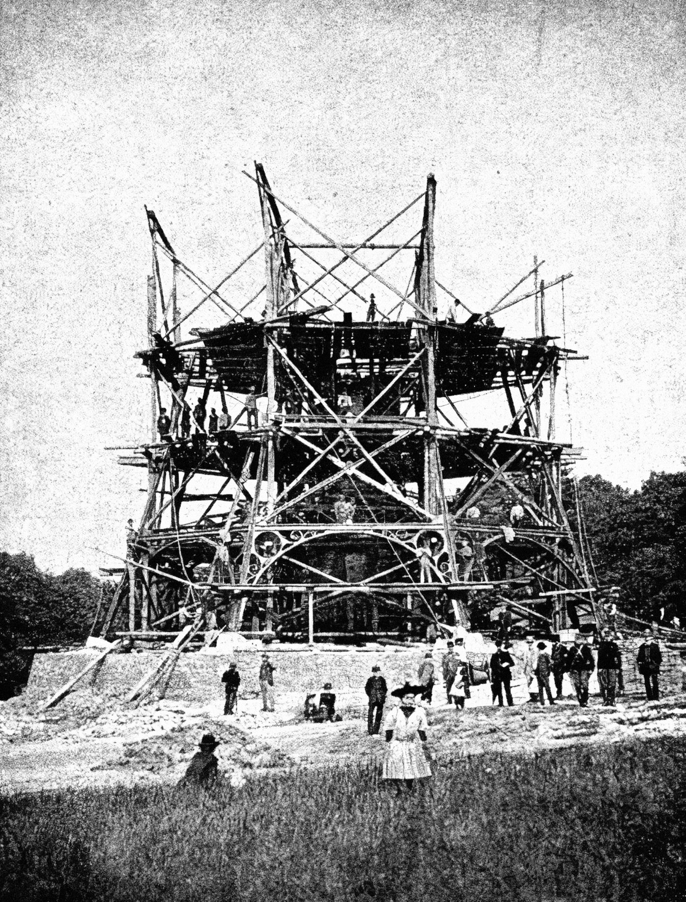
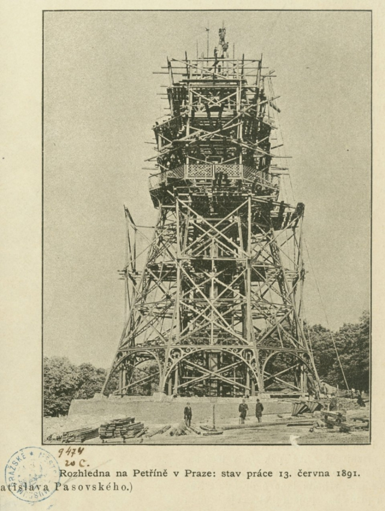
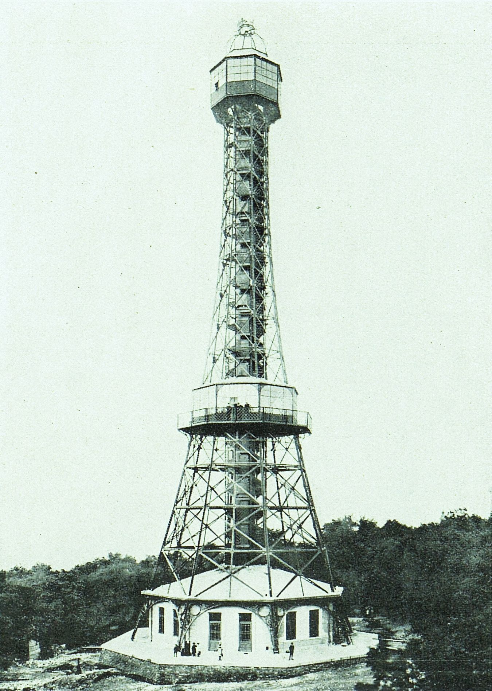
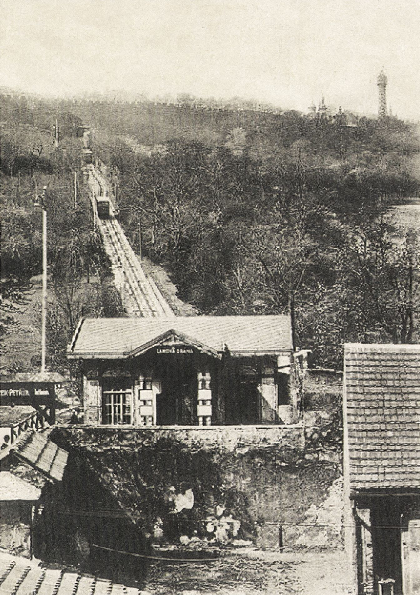
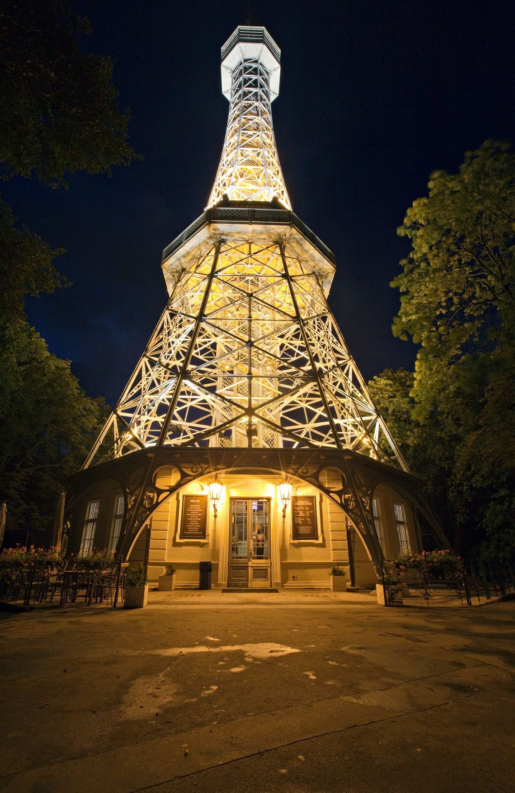

# Petřínská rozhledna

## Konstrukce rozhledny

Iniciativa k výstavbě Petřínské rozhledny, koncipované jako pětinásobně menší kopie pařížské Eiffelovy věže, vzešla od členů *Klubu českých turistů* (zejména spisovatele dr. Viléma Kurze /1847–1902/ a architekta Vratislava Pasovského /1854–1924/) po jejich návštěvě světové výstavy v Paříži v roce 1889 cestou vlakem do Prahy. K tomuto účelu bylo obratem založeno *Družstvo pro výstavbu rozhledny*, kterému se podařilo shromáždit rozpočet ve výši 32 000 zlatých a získat na Petříně pozemek v nadmořské výšce 324 metrů. Samotný návrh stavby vypracoval Vratislav Pasovský, přičemž autory ocelové konstrukce byli inženýři František Prášil (1845–1917, Mostárna Bratři Prášilové a spol. Praha-Libeň) a Julius Souček z Českomoravské strojírny. Vzhledem k tomu, že stavitelé v Čechách do té doby neměli s takto vysokými a lehkými železnými konstrukcemi žádné zkušenosti, využili při projektování své technické poznatky ze staveb důlních těžebních věží.

*Nákres Petřínské rozhledny.*[\[6\]](zdroje.md#petrinska_rozhledna-fn-6)

Základnu stavby tvoří osmiboká kamenná podezdívka, která funguje jako suterén s pochozí terasou. Na ni navazuje přízemní zděný pavilon ve tvaru oktogonu s neorenesanční fasádou, profilovanými okny a kupolovitou střechou s odlehčenou ocelovou konstrukcí. Do mohutných kamenných bloků v této základně je ukotveno osm hlavních ramen ocelové příhradové konstrukce. Úhlopříčka tohoto osmiúhelníku měří 21,65 metru a na výrobu samotné věže se spotřebovalo celkem 175 tun železa. Konstrukce je v úrovni přízemí zpevněna vyztužovacími oblouky a po celé své výšce zajištěna křížovým zavětrováním v podobě tzv. ondřejských křížů (jsou to diagonální prvky, táhla či vzpěry, křížící se uprostřed, které konstrukci zajišťují proti horizontálnímu zatížení, např. vítr nebo seismická aktivita aj., a zabraňují jejímu deformování. Jedná se o klasický inženýrský přístup ke zvýšení stability a únosnosti stavby).

*Petřínská rozhledna v různých fázích stavby.*[\[6\]](zdroje.md#petrinska_rozhledna-fn-6)

Do středu věže byl vložen osový tubus ukrývající výtah s kapacitou pro šest osob, poháněný zprvu plynem a následně elektřinou. Kolem tubusu se vinou dvě nezávislá dřevěná schodiště se zábradlím z nakoso kladených mříží – jedno odděleně slouží pro výstup a druhé pro sestup, přičemž na vrchol vede celkem 299 schodů. Ve výšce 20 metrů se nachází první prosklená plošina s otevřeným ochozem umístěným na konzolách. Horní vyhlídková kabina (s plnou poprsní a horním prosklením) je rovněž na konzolách a nachází se ve výšce přibližně 51 až 55 metrů. Původní střecha rozhledny byla zakončena vzdušnou kupolí, kterou zdobila mohutná stylizovaná svatováclavská koruna s českým lvem a vlajkou v národních barvách. Stavební práce započaly 16. března 1891 a probíhaly takovým tempem, že již 28. července byla věž zkolaudována a 20. srpna 1891 slavnostně otevřena. Celková výška ocelové konstrukce činí necelých 64 metrů a vrchol věže se tak díky svému umístění na kopci nachází přibližně ve stejné nadmořské výšce jako vrchol skutečné Eiffelovy věže v Paříži. Horní vyhlídka se pak nachází dokonce o něco výš než vyhlídka samotné Eiffelovy věže.

*Petřínská rozhledna s viditelným tubusem ve středu věže.*[\[6\]](zdroje.md#petrinska_rozhledna-fn-6)

## Provoz rozhledny

Petřínská rozhledna neplnila funkci tradičního výstavního pavilonu umístěného na bubenečském výstavišti, nýbrž vznikla jako oblíbená doprovodná atrakce, ke které se navíc návštěvníci výstavy mohli snadno dopravit nově vybudovanou lanovou dráhou z Újezdu. Hlavní atrakcí byl sám o sobě velkolepý výhled na památky Prahy a široké okolí Čech. Zděný přízemní pavilon byl koncipován jako restaurace a zázemí pro turisty. V prvním patře (20 metrů) pak návštěvníkům sloužila vyhlídková terasa s obedněným balkonem. Značnou technickou novinkou a noční podívanou se stalo večerní osvětlení – 19. prosince 1891 byla u samotné královské koruny na vrcholu instalována elektrická oblouková lampa, která podle dobového tisku vydávala tak jasné světlo, že se v okolí rozhledny dalo pohodlně číst. Dnes nabízí suterén rozhledny stálou expozici nazvanou „Petřín místo vycházek, rozhledu i dolování", jež s pomocí historických fotografií, plánů i dobového oblečení přibližuje historii dolování na Petříně, stavební ruch z konce 19. století a zásadní organizátorskou roli *Klubu českých turistů.*

*Lanová dráha na Petřín, rozhledna je k vidění vpravo nahoře.*[\[6\]](zdroje.md#petrinska_rozhledna-fn-6)

## Další osud rozhledny

Během své více než stoleté existence prošla stavba několika krizovými i přelomovými momenty. Počátkem července 1938, právě v době pražského sokolského sletu, došlo (pravděpodobně vlivem zkratu) k nebezpečnému požáru uvnitř výtahové kabiny. Návštěvníci naštěstí stihli včas sestoupit, ale oheň poškodil horní část konstrukce, což si vyžádalo stavební opravy. V době 2. světové války chtěl nechat rozhlednu zbourat Adolf Hitler. Velkou změnou byl pak 1. květen 1953, kdy rozhledna začala sloužit jako televizní vysílač. Osobní výtah byl tehdy kompletně zrušen, aby vnitřní tubus uvolnil místo napájecím kabelům. Původní královská koruna na vrcholu musela navždy ustoupit instalaci vysílací antény a pozdějšímu anténnímu nástavci. První vyhlídkový ochoz si rovněž zabraly spoje pro parabolické antény, turistům tak zbylo pro výstup jen schodiště a horní platforma k výhledům.

Do roku 1980 se technický stav schodišť i tubusu natolik zhoršil, že musela být památka pro veřejnost zcela uzavřena. K provizornímu a pouze částečnému zpřístupnění došlo krátce v roce 1991 na počest 100. výročí Jubilejní výstavy. Důkladná záchrana přišla až s generální rekonstrukcí prováděnou v letech 1999–2002 akciovou společností *Spojprojekt Praha*. Během ní byla řemeslně vyrobena zcela nová dřevěná schodiště opatřená protiskluzovým nátěrem, byl osazen nový bezpečný tubus a dovnitř byl nainstalován moderní výtah umožňující komfortní jízdu nahoru seniorům a osobám s handicapem. Dřívější dřevěný balkon v prvním patře se architektonicky proměnil na elegantní vyhlídkový ochoz, jenž je nyní částečně bezbariérově přístupný pro vozíčkáře. Znovuotevření rozhledny proběhlo na jaře roku 2002 a od té doby věž slouží celoročně jako jedna z nejvyhledávanějších památek ve správě *Prague City Tourism.*

*Dnešní podoba rozhledny. V noci je často nasvícena žlutým světlem.*[\[6\]](zdroje.md#petrinska_rozhledna-fn-6)

---

[→ Zdroje k této stránce](zdroje.md#zdroje-petrinska_rozhledna)
