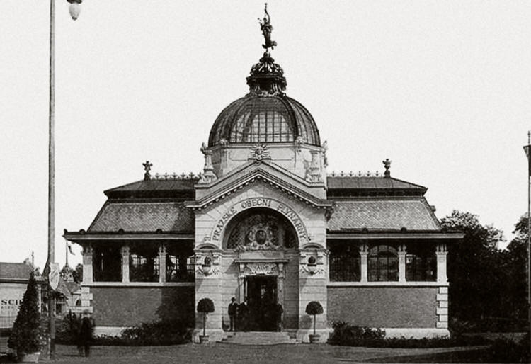

# Pavilon městské plynárny pražské

Cílem výstavního pavilonu bylo ukázat pokročilost tehdejších technologií v oblasti plynu a ukázat konkurenceschopnost vůči elektrické energii. Elegantní stavbu navrhl architekt Jiří Stibral (1859–1939). Architekt Stibral se na Jubilejní výstavě podílel dalšími pracemi: navrhl pavilon hraběte Sylva-Tarouca, přestavěl pavilon hraběte Harracha a uspořádal expozici Staré Prahy.

Pavilon Městské plynárny pražské měl železnou konstrukci (skeletový systém z kovu) vyplněnou cihlami. Tento stavební systém byl na konci 19. století považován za pokrokový, neboť umožňoval rychlou montáž, velké otevřené vnitřní prostory pro expozici a efektní architektonické formy (např. kupole, prosklení), tj. Byl obdobný jako u stavby Průmyslového paláce. Vrcholek pavilonu tvořila železná prosklená kopule zakončená svítící zlatou korunou a osvětlenou sochou vznášejícího se génia. Pavilon byl osvětlen třemi tisíci plynovými hořáky.

*Pavilon městské plynárny pražské na Jubilejní zemské výstavě v Praze 1891. Pavilon se třemi tisíci plynovými hořáky, svítící zlatou korunou a sochou vznášejícího se génia.*[\[1\]](zdroje.md#plynarensky_pavilon-ref-1)

---

[→ Zdroje k této stránce](zdroje.md#zdroje-plynarensky_pavilon)
