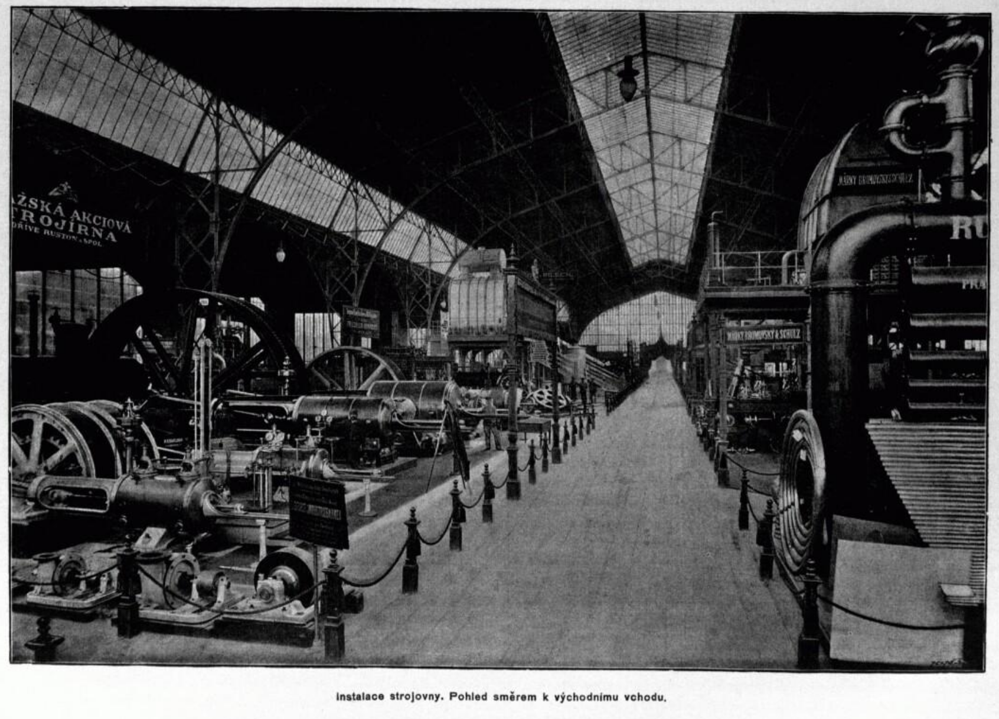
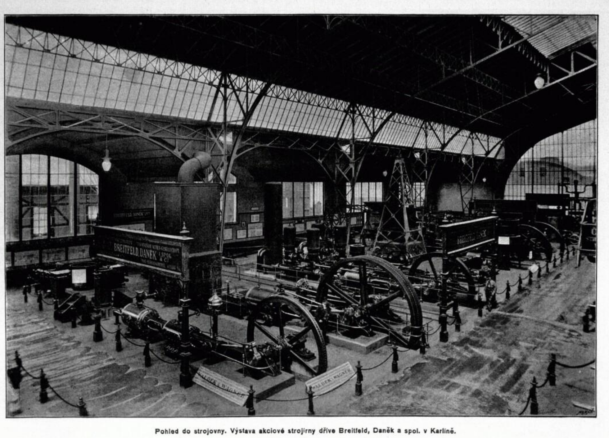
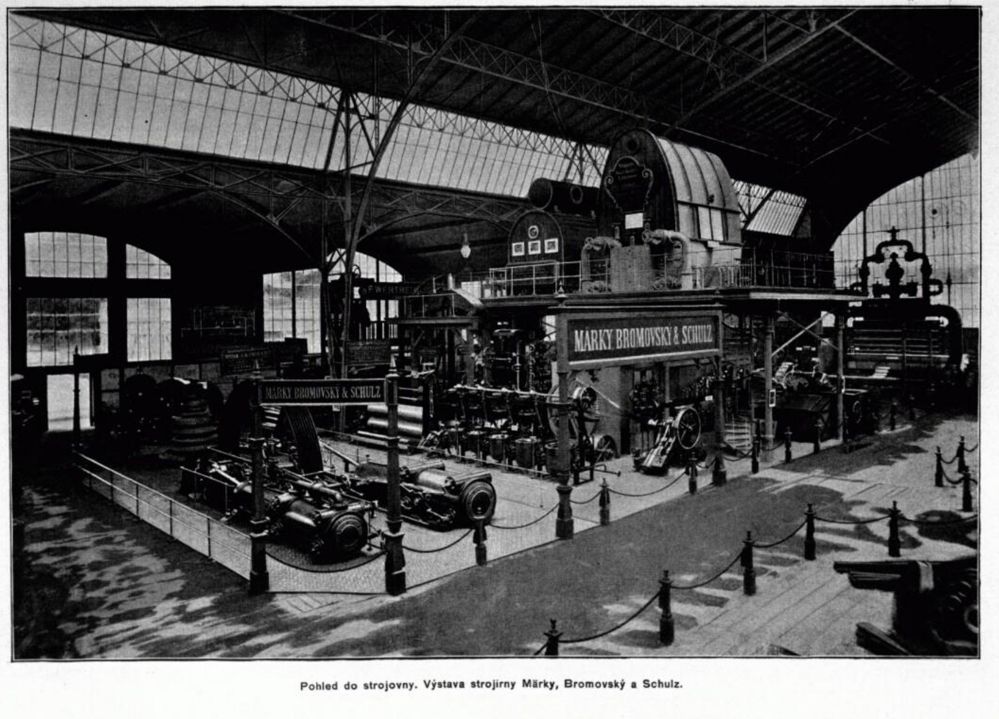
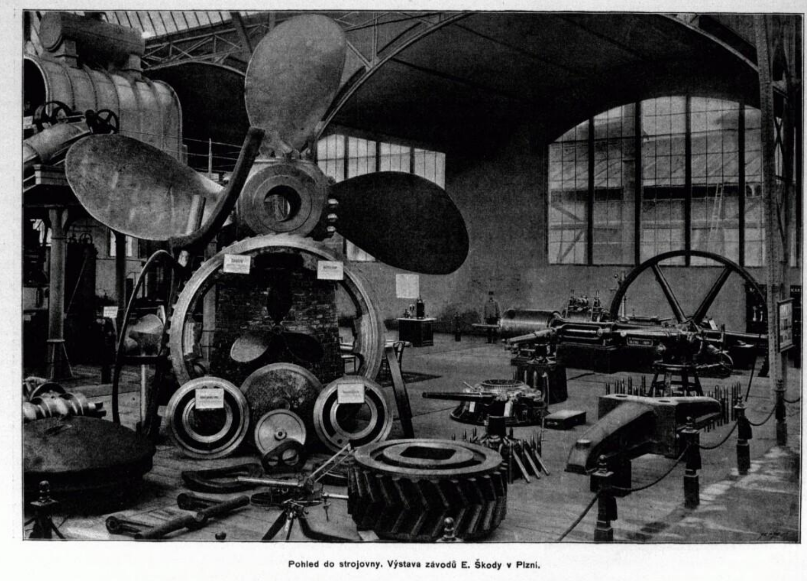
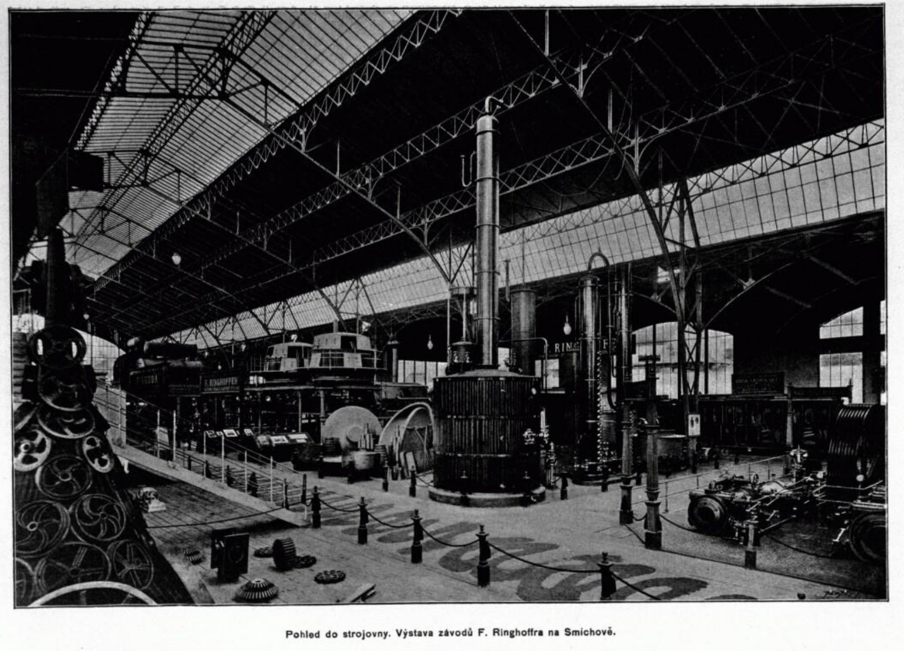
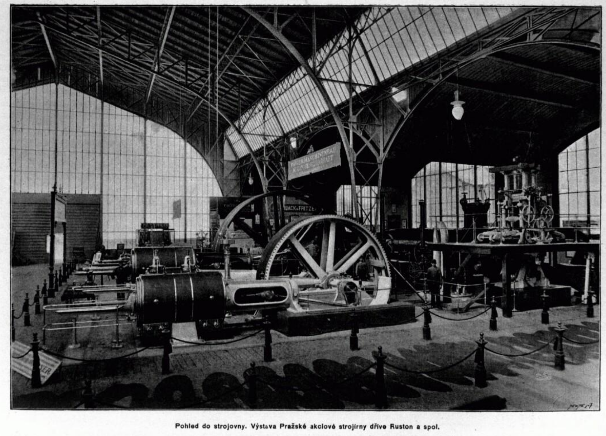
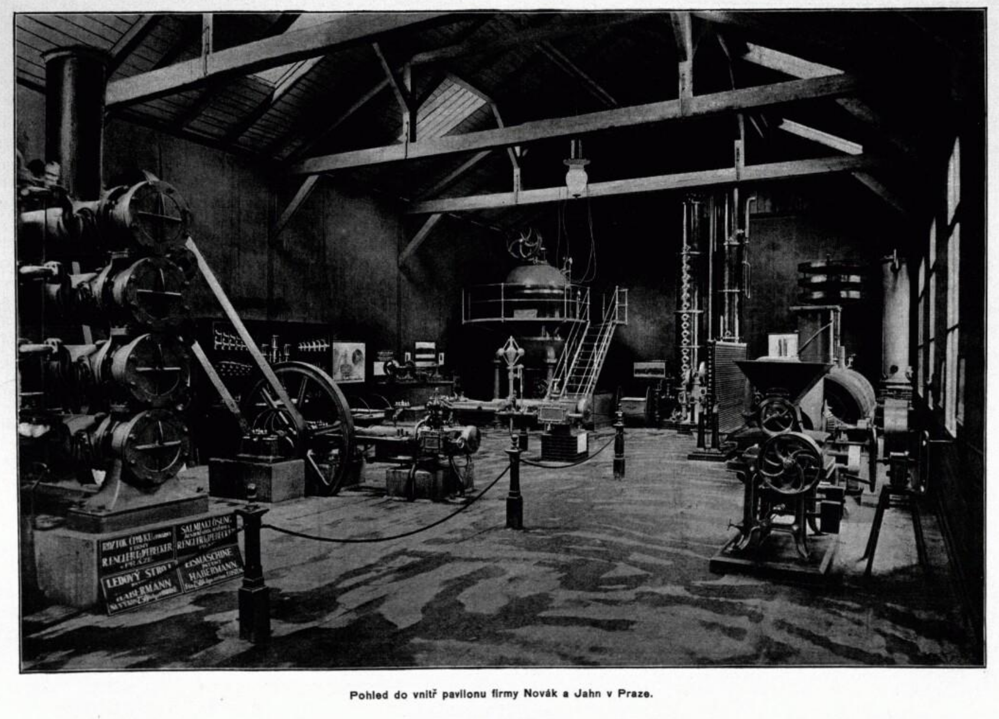
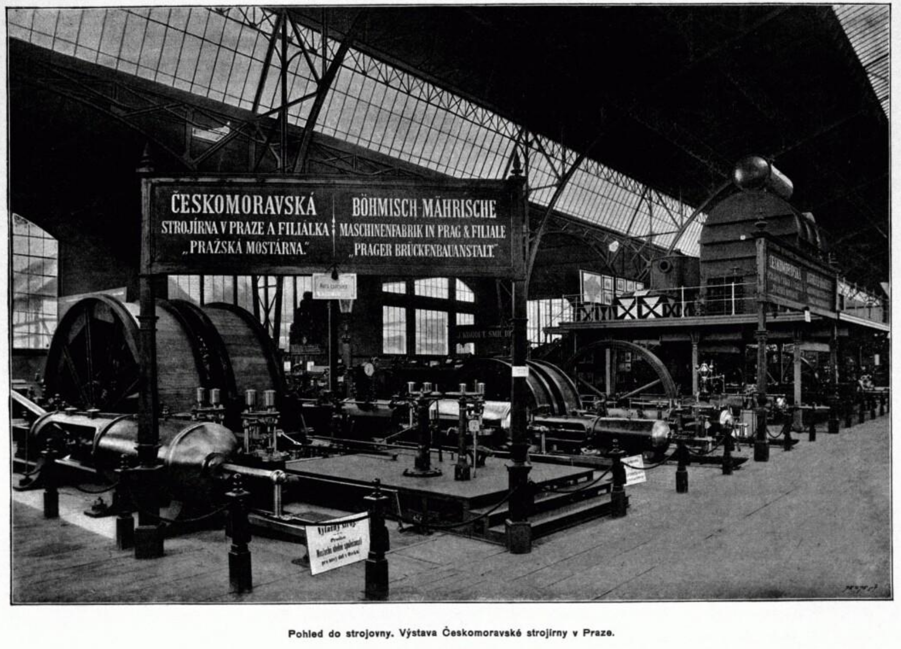
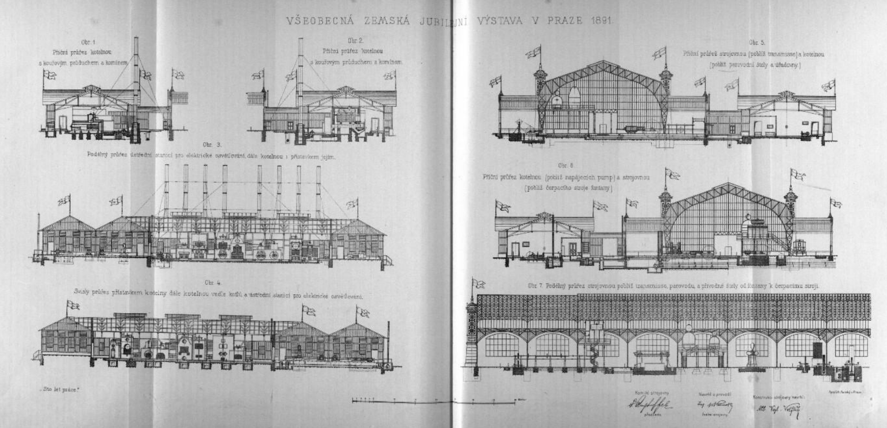
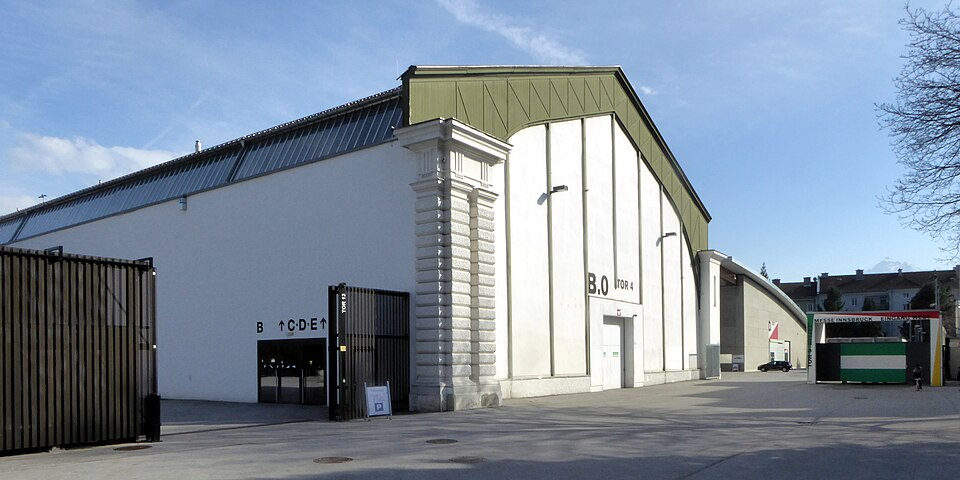

# Pavilon strojů (Strojovna)

Strojovna byla po Průmyslovém paláci druhým největším objektem celého výstaviště. Tento pavilon se nacházel v severní části areálu a soustředil v sobě nejvýznamnější představitele tehdejšího českého strojírenského průmyslu.

## Konstrukce výstavního pavilonu

Původní provedení mělo být dřevěné, jelikož šlo o dočasnou stavbu. To se však nezdálo tehdejším průmyslníkům dostatečné (ať už z reprezentativního či inženýrského hlediska) a nakonec došlo ke změně na provedení se železnou konstrukcí – kostru tvořilo dvanáct obloukových nosníků s výškou 17, 50 m a rozestupem 12, 20 m.

Zmíněná konstrukce byla zbudována *Pražskou akciovou strojírnou a mostárnou* a navrhl ji inženýr Albert Vojtěch Velfík (1856–1920). Zděná a tesařská část vznikla podle návrhu architekta Bedřicha Münzbergera (1846–1928). Oproti jiným pavilonům byla stavba silně účelová, jedinými dekorativnějšími prvky byly skleněné výplně ve slabých železných rámech (světlíky).

Co se týče rozlohy, hlavní hala zaujímala plochu 6 722 m2. Na samotný výstavní prostor navazovala na severní straně Strojovny kotelna a elektrická stanice. Spolu s těmito přístavbami dosahovala rozloha téměř 9 000 m2.

## Kotelna a elektrická stanice

Kotelna sloužila nejen samotné strojovně, ale i dalším objektům výstaviště. Ze strojovny se řídil i chod Křižíkovy *Světelné fontány*. V kotelně se nacházelo 8 parních kotlů, přičemž každý disponoval vlastním komínem. Kromě funkčnosti byla samotná technologie též výstavním exponátem.

Elektrická stanice disponovala dynamoelektrickými stroji od firmy Františka Křižíka v Karlíně. Většina byla stavěna na hladinu 100 V a 300 A, několik strojů bylo většího výkonu s jmenovitým proudem 500 A.

Vedle samotné elektrické stanice bylo místo, kde se nacházela sestava venkovních expozicí.

## Hlavní expozice a vystavovatelé

V centrální lodi Strojovny soupeřily o pozornost nejvýznamnější české závody té doby. Celkem zde bylo presentováno 89 expozic podnikatelů z českých zemí Níže je uvedený výběr ze seznamu významných firem, včetně exponátů, které byly prezentovány.

- **Závody Emila Škody:** Vystaven byl obrovský lodní šroub.

- **Firma František Ringhoffer:** Expozice formy vznikla naproti Závodům Emila Škody.

- **Českomoravská továrna na stroje:** V zadní části Strojovny bylo vystaveno masivní rozdružovadlo na uhlí a další zařízení pro doly.

- **Akciová společnost, dříve Breitfeld, Daněk a spol.:** Vystavovali stožárové signální přístroje pro železnice a pojezdný parní jeřáb pro použití v přístavech.

- **Pražská akciová strojírna (Ruston a spol.):** Firma se pochlubila konstrukcí celého pavilonu Strojovny.

- **Bolzano, Tedesco a spol.:** Expozice zahrnovala kompletní šachetní těžní zařízení včetně klecí.

Kromě zmíněných probíhala výstava i dalších –firem. Vystaveny byly např. parní stroje, stroje pro cukrovarnictví a mlýny, hydraulické lisy, obráběcí stroje – např. Märky, Bromovský a Šulc, Josef Janáček, František Wiesner, Frič a Macháček, Schiller a Dewetter, Jakub Raubitschek, Martinka a spol., Julius Hübner a Karl Opitz, , Ignác Storek, Carl und Wilhelm Umrath a spol., František Volman, Svatoňovická továrna, Josef Horák aj. .

## Rozebrání a osud pavilonu

Účelová železná konstrukce strojovny poskytla možnost stavbu následně snadno demontovat, v souladu s původní myšlenkou, že se jedná o dočasné umístění. Stavba byla po rozebrání převezena do dnešního Rakouska, kde ji lze vidět v Innsbrucku jako Messehalle B.

Ve dvacátých a třicátých letech 20. století došlo k přestavbám a modifikacím. Důkazem vyspělosti tehdejšího průmyslu budiž fakt, že při revizích v roce 2010 bylo zjištěno, že původní železná konstrukce je dodnes prakticky netknutá korozí. Hala byla následně částečně odstrojena od moderních nadstaveb a dnes spíše připomíná původní formu.

Umístěna je v komplexu Messegelände Innsbruck určeném pro veletrhy, festivaly a podobné události. V komplexu probíhaly např. některé zápasy ledního hokeje na ZOH v letech 1964 a 1976, kde v obou případech získalo tehdejší Československo medaili, a to bronzovou a stříbrnou.

## Obrázky

---

[→ Zdroje k této stránce](zdroje.md#zdroje-strojovna)
