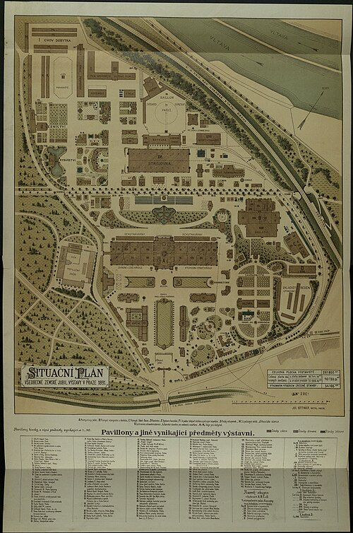
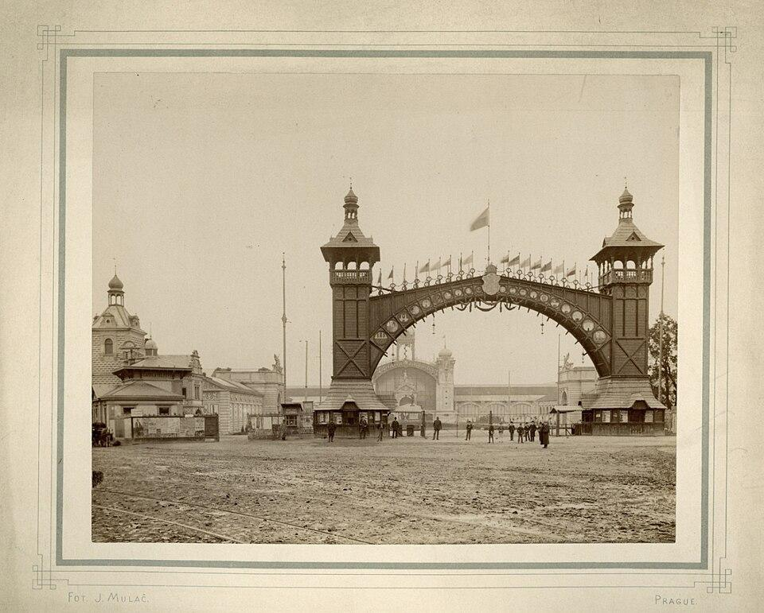
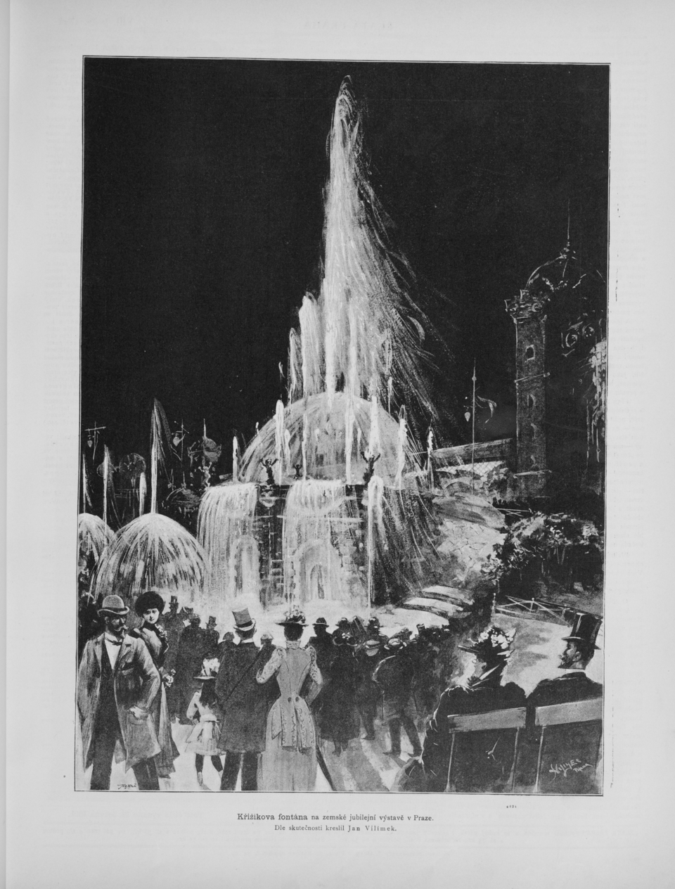

# Výstavba výstaviště Jubilejní výstavy 1891

Pro potřeby Jubilejní výstavy bylo nutné vybudovat zcela nový výstavní areál. Jako nejvhodnější lokalita byla zvolena oblast v dnešních Holešovicích u parku Stromovka. V té době šlo o poměrně nezastavěné území, které umožňovalo realizaci rozsáhlého koordinovaného projektu.

Rozhodnutí o výstavbě padlo koncem 80. let 19. století a samotná realizace probíhala ve velmi krátkém čase, přibližně během dvou let před zahájením výstavy v roce 1891. Šlo o mimořádně náročný projekt, který vyžadoval koordinaci velkého množství odborníků, dělníků i dodavatelů.

Přípravy navíc komplikovala velká povodeň v Praze v září roku 1890. Rozvodněná Vltava zaplavila část staveniště i okolních komunikací a hrozilo, že termín otevření výstavy nebude možné dodržet. Díky intenzivní práci stavebních firem a organizátorů se však podařilo většinu škod rychle odstranit a areál dokončit včas.

## Rozsah a organizace stavby

Celý areál zabíral plochu přibližně 300 000 m² a zahrnoval kolem 150 výstavních objektů. Tyto budovy měly většinou dočasný charakter, ale jejich konstrukce musela být dostatečně kvalitní, aby vydržela nápor statisíců návštěvníků.

Na výstavbě se podílela řada významných osobností:

- Bedřich Münzberger (1846–1928) – architekt, hlavní projektant areálu

- Antonín Wiehl (1846–1910) – architekt historizujících slohů, zejména renesance, vytvořil architektonické návrhy pavilonů

- František Thomayer (1856–1938) – architekt a významný projektant zahradních úprav, podílel se na úpravě zeleně a okolí výstaviště

Jednotlivé pavilony vznikaly paralelně a práce probíhaly téměř nepřetržitě, aby byl dodržen pevně stanovený termín otevření.

## Hlavní pavilony a objekty výstavy

Součástí areálu byla řada tematických pavilonů a reprezentativních staveb. Mezi nejvýznamnější patřily:

- Průmyslový palác

- Strojní pavilon

- Pavilon českých měst

- Pavilon zemědělství a lesnictví

- Pavilon hutnictví a strojírenství

- Pavilon umění

- Pavilon sklářství a keramiky

- Česká chalupa

- Restaurace a společenské pavilony

- Hudební pavilony

- Administrativní budovy výstavy

- Křižíkova elektrická fontána

*Situační plán areálu Jubilejní zemské výstavy v Praze z roku 1891, zobrazující rozmístění jednotlivých pavilonů a budov.*[\[11\]](zdroje.md#vystavba_vystaviste-ref-11)

Významnou součástí výstavy byly také technické atrakce a dopravní novinky. Návštěvníci mohli využít první elektrickou tramvaj Františka Křižíka, která spojovala část Prahy s výstavištěm. Velký zájem vzbudila také lanová dráha na Petřín a nově postavená Petřínská rozhledna, inspirovaná pařížskou Eiffelovou věží. Tyto stavby se staly symbolem technického pokroku českých zemí na konci 19. století.

## Průmyslový palác – hlavní stavba

Dominantou celého výstaviště se stal ***Průmyslový palác***, jedna z nejmodernějších staveb své doby ve stylu průmyslové secese.

Byl postaven z kombinace železné konstrukce a skla, což umožnilo vytvořit velký, otevřený a světlý prostor pro expozice. Tato technologie byla inspirována světovými výstavami (např. v Paříži nebo Londýně) a představovala vrchol tehdejší architektury.

Stavba paláce byla technicky velmi náročná, protože vyžadovala přesnou výrobu kovových dílů i jejich rychlou montáž přímo na místě. Přesto se ji podařilo dokončit včas před zahájením výstavy.

*Slavnostní vstupní brána, v pozadí Průmyslový palác.*[\[12\]](zdroje.md#vystavba_vystaviste-ref-12)

## Technické řešení a infrastruktura

Výstavba areálu nezahrnovala jen samotné pavilony, ale i kompletní infrastrukturu:

- budování cest a komunikačních tras v areálu

- zavedení elektrického osvětlení (na tehdejší dobu velmi pokrokové, v podstatě propagační ve vztahu k firmě Františka Křižíka)

- instalace vodovodních a kanalizačních systémů

- příprava prostoru pro dopravu návštěvníků včetně elektrické tramvaje

Velkou roli sehrál František Křižík, který se podílel na elektrifikaci areálu. Díky tomu patřilo výstaviště k technologicky nejvyspělejším projektům v českých zemích na konci 19. století.

*Křižíkova elektrická fontána na Jubilejní výstavě v Praze (1891), jedna z hlavních technických atrakcí s kombinací vody, světla a hudby.*[\[13\]](zdroje.md#vystavba_vystaviste-ref-13)

## Charakter staveb

Většina pavilonů byla navržena jako dočasné stavby, často ze dřeva nebo lehkých konstrukcí. Důraz byl kladen na rychlost výstavby a estetický vzhled.

Naopak některé budovy (především Průmyslový palác) byly koncipovány jako trvalé a měly sloužit i po skončení výstavy. To se také potvrdilo, protože se dochovaly dodnes a staly se součástí pražského Výstaviště.

---

[→ Zdroje k této stránce](zdroje.md#zdroje-vystavba_vystaviste)
