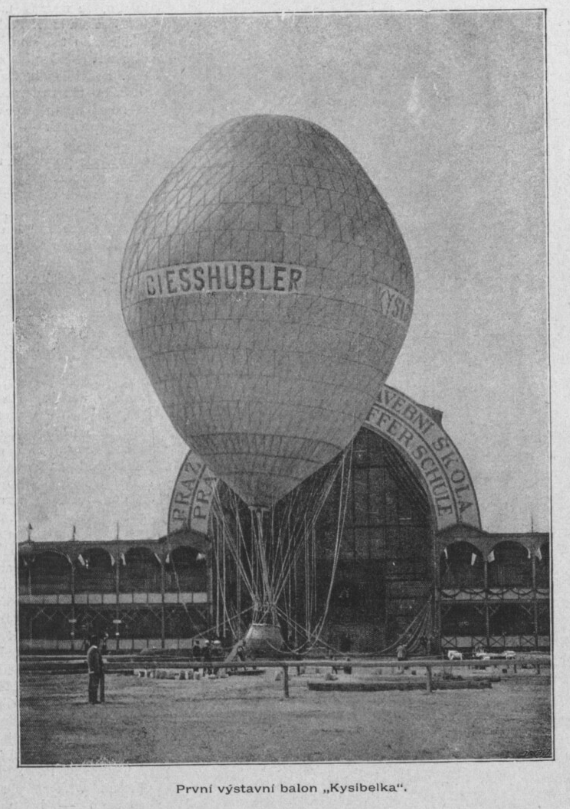
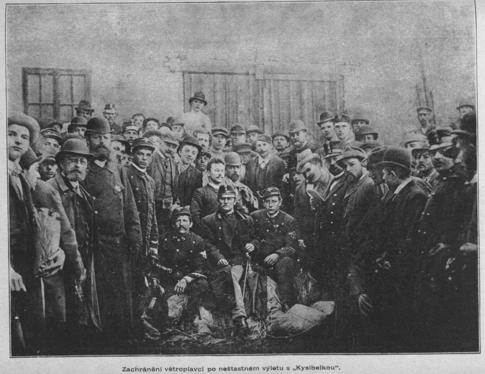
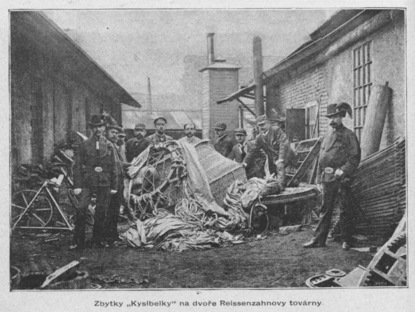
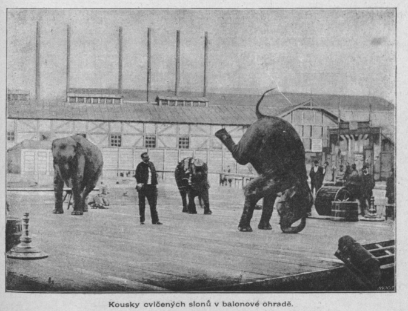
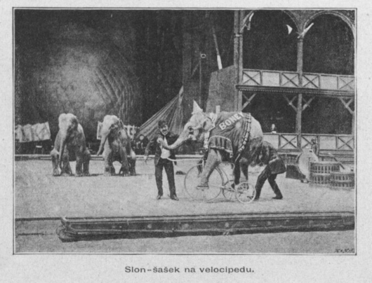
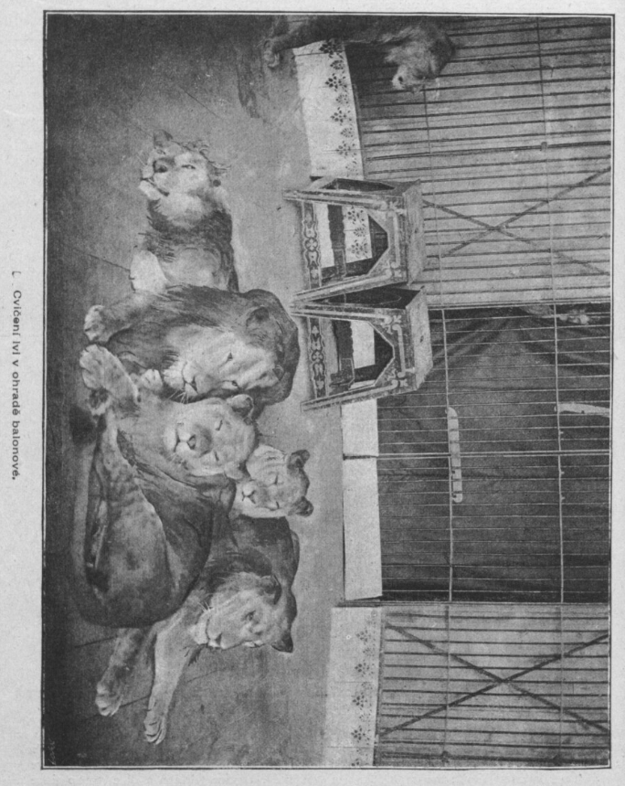
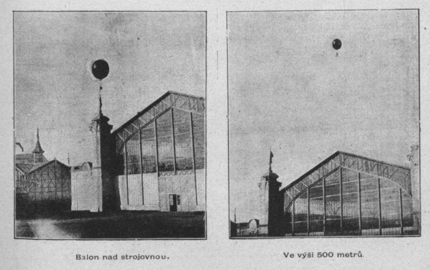
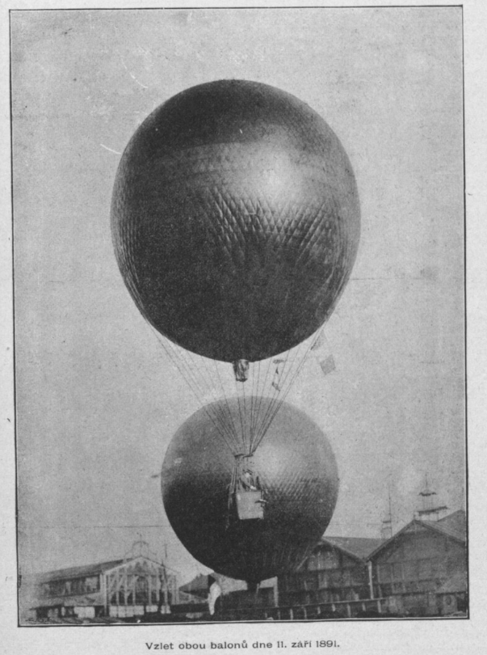

# Balonová ohrada

## Vzduchoplavba po otevření

Populární atrakcí výstaviště byla balonová aréna s názvem *Pražská vzduchoplavecká škola* u Vltavy v severní části výstavního areálu. Provozovatelem se stal podnikatel Samuel Hoffmann, který pozval vzduchoplavce Maxmiliána Wolffa z Kolína nad Rýnem. Ten přivezl vlastnoručně ušitý balon o objemu 2 000 m³ nepravidelného tvaru. Za sponzorský příspěvek 4 000 zlatých opatřila firma Mattoni balonu reklamní nápis a atrakce dostala jméno Kysibelka. Vyhlídkové výstupy do výše 300 metrů stály 2 zlatky a probíhaly až dvacetkrát denně.

*Nafouklý výstavní balon Kysibelka.*[\[1\]](zdroje.md#vzduchoplavba-ref-1)

## Havárie balonu Kysibelka

Na nátlak veřejnosti souhlasil Wolff s volným letem, který byl proveden 16. června 1891, přičemž on sám celou akci řídil ze země. Balon stoupal klidně přes Letnou, jenže obal byl přeplněn plynem a odvzdušňovací záklopka nefungovala spolehlivě. Ve vyšší výšce se plyn rozpínal a Kysibelka se ve vzduchu roztrhla. Trosky padaly na tovární komplexy (zejména na stavbu komínů pro Holešovickou elektrárnu) v Praze-Holešovicích, kde se částečně vzňaly od tavící pece a musely být uhašeny. Posádka přežila bez vážných zranění. Wolff samotný byl odsouzen k osmi dnům vězení, ale uprchl do ciziny.

*Fotografie pořízené po havárii Kysibelky.*[\[1\]](zdroje.md#vzduchoplavba-ref-1)

## Využití po havárii

Přítomnost balonu dočasně v ohradě nahradila různá zvířata. Populární byla zejména ta exotická v podobě cvičených slonů a lvů.

*Náhradní program balonové ohrady v podobě představení s cvičenými zvířaty.*[\[1\]](zdroje.md#vzduchoplavba-ref-1)

Organizátoři výstavy pak pozvali francouzské vzduchoplavce (Édouard Surcouf, Louis Godard a Eugéne Taupin), kteří přijeli do Prahy 18. 7. 1891 zprvu se svým jednomístným balonem Victor Hugo (o průměru 9 m a objemu necelých 400 m³), později doplněným větším balonem. Francouzští vzduchoplavci prováděli lety na provazu i volně. V úterý 18. 8. 1891 letěl Godard z výstaviště s redaktory českých časopisů. Ti s nadšením psali o krásném letu ve výšce 2000 m. Přistáli u Veltrus. Francouzští vzduchoplavci provedli i množství unikátních vzduchoplaveckých kousků:

- Dlouhá vzduchoplavba až do Pardubic
- Let dvou balonů současně k příležitosti 100. výročí od okamžiku prvního vzletu balonu v Praze
- Údajně první skok padákem nad Prahou, který proběhl 1. října 1891
- Noční vzlet a cesta až k městu Stargard, které se nachází v dnešním Polsku, 80 km od Baltského moře

*Let francouzských vzduchoplavců nad budovou Strojovna.*[\[1\]](zdroje.md#vzduchoplavba-ref-1)

*Let dvou balonů při příležitosti 100. výročí prvního vzduchoplavectví v Praze.*[\[1\]](zdroje.md#vzduchoplavba-ref-1)

---

[→ Zdroje k této stránce](zdroje.md#zdroje-vzduchoplavba)

